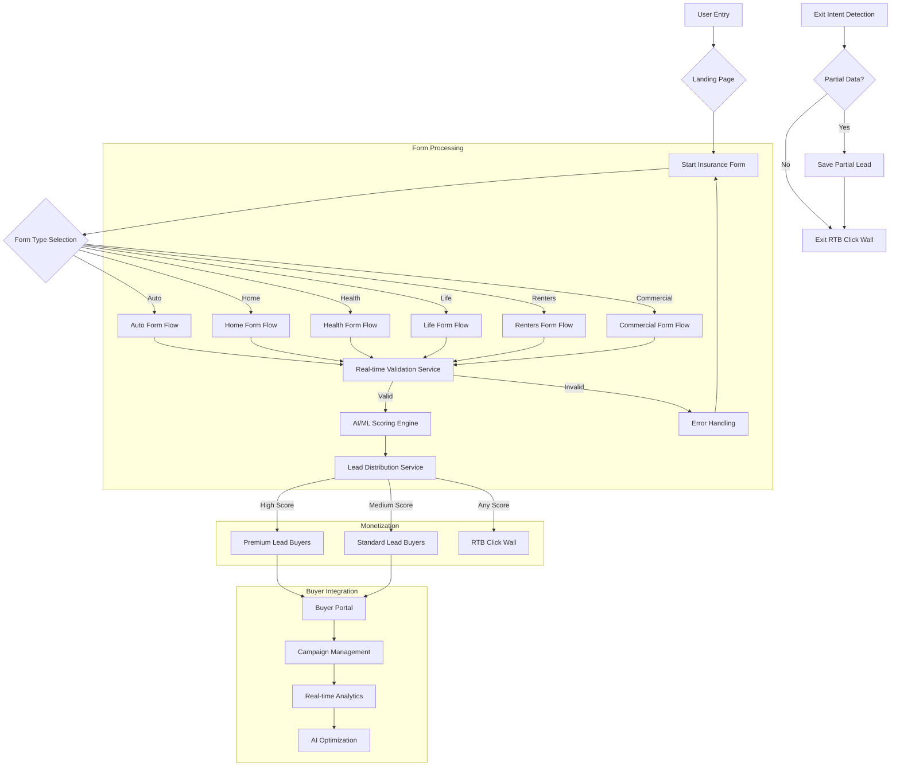
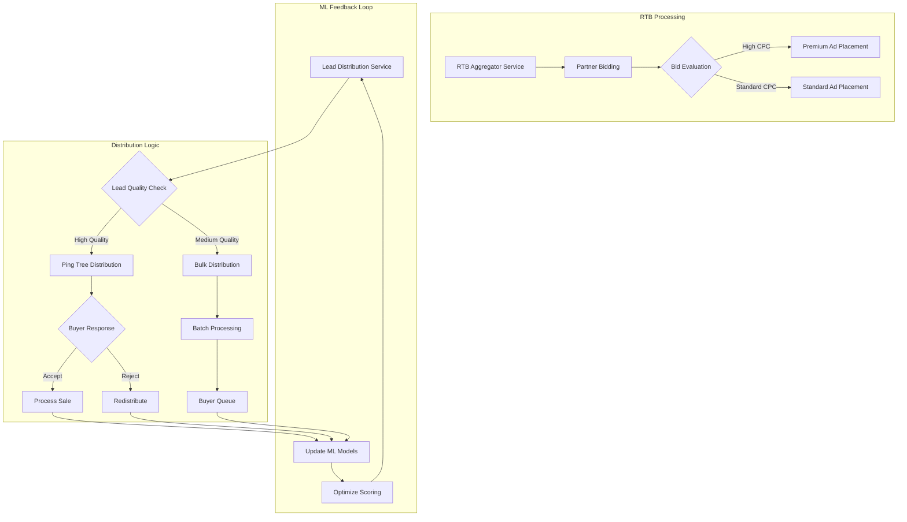
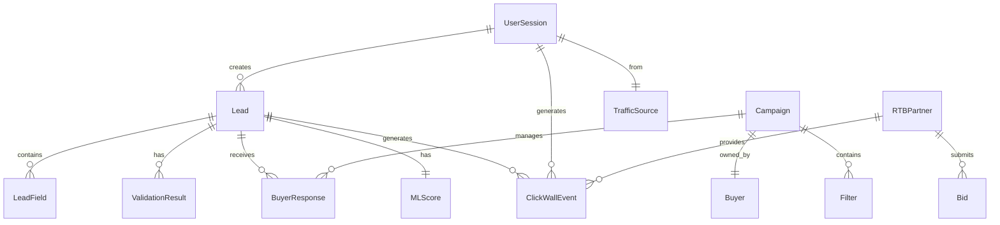
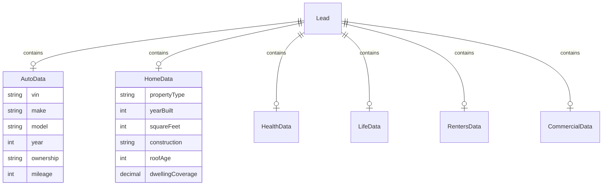
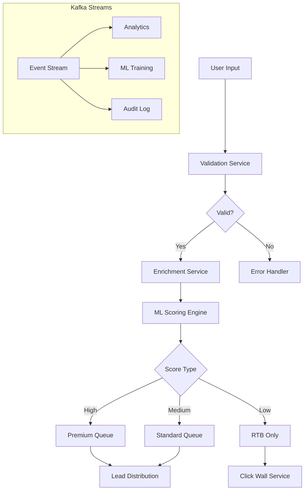
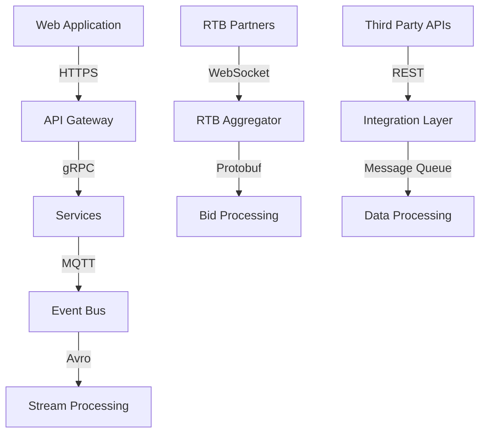
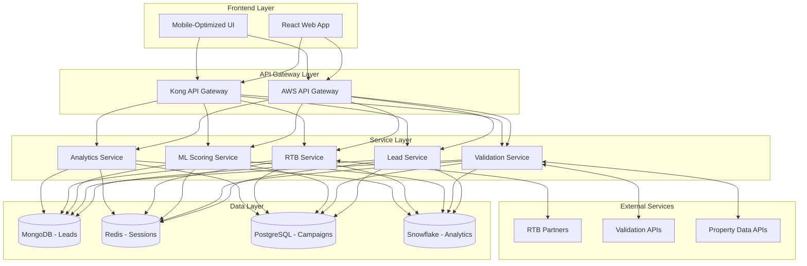

# Product Requirements Document (PRD)

# 1. INTRODUCTION

## 1.1 Purpose

This Software Requirements Specification (SRS) document provides a comprehensive description of the multi-vertical insurance lead generation platform. It details the functional, technical, and business requirements for stakeholders including:

- Development and QA teams implementing the platform
- Project managers and technical leads overseeing development
- Business stakeholders validating requirements alignment
- Integration partners requiring technical specifications

## 1.2 Scope

The platform encompasses an AI-driven insurance lead generation system that:

- Captures and validates consumer data across Auto, Home, Renters, Health/Medicare, Life, and Commercial insurance verticals
- Implements real-time lead scoring and monetization through both lead sales and RTB click walls
- Provides a self-service buyer portal for campaign management
- Delivers validated leads via API integrations to insurance carriers and agents
- Optimizes revenue through machine learning models that analyze user behavior and lead quality
- Supports future expansion into direct policy binding capabilities

Key Features:

- Multi-step form funnels with real-time validation
- AI/ML-based lead scoring and pricing optimization
- Mandatory click walls with RTB integration
- Cross-vertical selling and bundle optimization
- Comprehensive buyer portal with real-time analytics
- Microservices architecture supporting high scalability
- Enterprise-grade security and compliance measures

Out of Scope:

- Policy management or claims processing
- Consumer-facing insurance comparison tools
- Agent/carrier CRM functionality
- Payment processing systems
- Direct consumer policy servicing

# 2. PRODUCT DESCRIPTION

## 2.1 Product Perspective

The multi-vertical insurance lead generation platform operates as a standalone system that interfaces with multiple external systems and stakeholders:

- Consumer-facing web interface for lead capture across insurance verticals
- Integration with third-party validation services (phone, email, address)
- Real-time bidding (RTB) connections to ad partners (Quinstreet, Media Alpha, Kissterra)
- API endpoints for lead distribution to insurance carriers and agents
- Integration with property data providers (Zillow/Realtor) and VIN lookup services
- Cloud infrastructure (AWS/Azure/GCP) hosting the microservices architecture

## 2.2 Product Functions

The platform provides these core functions:

1. Lead Generation & Validation

- Multi-step form collection across 6 insurance verticals
- Real-time data validation and enrichment
- Dynamic form progression based on user inputs
- Partial lead capture and recovery

2. AI/ML Operations

- Real-time lead scoring and quality assessment
- Predictive analytics for lead pricing
- Behavioral analysis for cross-sell opportunities
- Continuous model refinement based on buyer feedback

3. Monetization

- Lead distribution to qualified buyers
- Real-time bidding integration for click walls
- Dynamic pricing based on lead quality
- Exit-intent monetization

4. Campaign Management

- Self-service buyer portal
- Real-time campaign performance metrics
- Automated budget management
- AI-driven optimization recommendations

## 2.3 User Characteristics

1. Consumers

- Demographics: Adults 18+ seeking insurance quotes
- Technical Proficiency: Basic web browsing skills
- Device Usage: 70%+ mobile users
- Time Sensitivity: Expect quick, efficient process

2. Insurance Buyers

- Professional insurance agents and carrier representatives
- Advanced understanding of insurance products
- Regular platform users requiring detailed analytics
- Technical capability to integrate with APIs

3. System Administrators

- Technical staff managing platform operations
- Deep understanding of insurance industry
- Experience with complex data systems
- Security clearance for sensitive data access

## 2.4 Constraints

1. Technical Constraints

- Must maintain sub-second response times for validations
- 99.9% uptime SLA requirement
- Mobile-first design requirements
- Real-time processing of high-volume data streams

2. Regulatory Constraints

- TCPA compliance for lead generation
- State-specific insurance regulations
- Data privacy requirements (CCPA, GDPR)
- PII handling and storage regulations

3. Business Constraints

- Integration with existing RTB partner protocols
- Lead buyer technical capabilities
- Market-driven lead pricing pressures
- Competition with existing lead providers

## 2.5 Assumptions and Dependencies

Assumptions:

- Stable internet connectivity for real-time operations
- Continued availability of third-party validation services
- Consistent RTB partner participation
- Reliable cloud infrastructure performance

Dependencies:

- Third-party data providers (Zillow, VIN services)
- RTB partner platforms
- Payment processing systems
- Email/phone validation services
- Cloud service providers
- Machine learning training data availability

# 3. PROCESS FLOWCHART





# 4. FUNCTIONAL REQUIREMENTS

## 4.1 Lead Generation & Validation

### ID: F1

### Description

Multi-vertical lead capture system with real-time validation and data enrichment capabilities.

### Priority: P0 (Critical)

| Requirement ID | Requirement Description | Validation Criteria |
| --- | --- | --- |
| F1.1 | System must provide dynamic form progression across 6 insurance verticals (Auto, Home, Renters, Health/Medicare, Life, Commercial) | All form paths function correctly with proper branching logic |
| F1.2 | Implement real-time validation for phone, email, and address using third-party services | \>98% validation accuracy for submitted contact data |
| F1.3 | Integrate property data pre-fill (Zillow/Realtor) for Home/Renters insurance | Successful API integration with \<1s response time |
| F1.4 | Enable partial VIN lookup for Auto insurance forms | \>95% accuracy in vehicle data retrieval |
| F1.5 | Store partial lead data for abandoned sessions | Successful recovery of partial leads with proper user mapping |

## 4.2 AI/ML Scoring Engine

### ID: F2

### Description

Real-time lead scoring and optimization system using machine learning models.

### Priority: P0 (Critical)

| Requirement ID | Requirement Description | Validation Criteria |
| --- | --- | --- |
| F2.1 | Score leads in real-time based on user attributes and behavior | Scoring completed within 100ms |
| F2.2 | Integrate buyer feedback loop for continuous model improvement | Daily model updates based on acceptance rates |
| F2.3 | Provide dynamic pricing recommendations for lead sales | Price optimization resulting in \>10% revenue increase |
| F2.4 | Generate behavioral analysis for cross-sell opportunities | Accurate prediction of bundle conversion probability |
| F2.5 | Support A/B testing of scoring models | Automated performance comparison of model variants |

## 4.3 Click Wall & RTB Integration

### ID: F3

### Description

Mandatory click wall system with real-time bidding integration.

### Priority: P0 (Critical)

| Requirement ID | Requirement Description | Validation Criteria |
| --- | --- | --- |
| F3.1 | Display RTB-powered click wall on Thank You pages | \<500ms load time for ad display |
| F3.2 | Implement exit-intent detection and monetization | Successful capture of \>30% abandoning users |
| F3.3 | Integrate with multiple RTB partners (Quinstreet, Media Alpha, Kissterra) | Successful real-time bid collection from all partners |
| F3.4 | Optimize ad placement based on ML scoring | \>15% improvement in click-through rates |
| F3.5 | Support mobile-optimized ad formats | Proper rendering across all device types |

## 4.4 Buyer Portal

### ID: F4

### Description

Self-service platform for lead buyers to manage campaigns and analyze performance.

### Priority: P1 (High)

| Requirement ID | Requirement Description | Validation Criteria |
| --- | --- | --- |
| F4.1 | Provide campaign creation and management interface | Successful campaign setup and modification |
| F4.2 | Display real-time performance analytics | Dashboard updates within 5 minutes of events |
| F4.3 | Enable automated budget management | Accurate spend tracking and alerts |
| F4.4 | Generate AI-driven optimization recommendations | Weekly actionable insights per campaign |
| F4.5 | Support role-based access control | Proper permission enforcement |

## 4.5 Cross-Vertical Optimization

### ID: F5

### Description

System for identifying and executing cross-sell opportunities across insurance verticals.

### Priority: P1 (High)

| Requirement ID | Requirement Description | Validation Criteria |
| --- | --- | --- |
| F5.1 | Identify bundle opportunities based on user data | \>25% accuracy in bundle prediction |
| F5.2 | Generate dynamic cross-sell prompts | \<5% form abandonment from cross-sell offers |
| F5.3 | Optimize bundle pricing through ML models | \>20% increase in bundle conversion rates |
| F5.4 | Track cross-vertical user journey | Complete funnel analytics for multi-vertical users |
| F5.5 | Support vertical-specific data sharing | Proper data mapping between verticals |

## 4.6 Future Direct-Bind Integration

### ID: F6

### Description

Framework for supporting direct policy binding capabilities in Phase 2.

### Priority: P2 (Medium)

| Requirement ID | Requirement Description | Validation Criteria |
| --- | --- | --- |
| F6.1 | Design carrier integration architecture | Documentation of integration specifications |
| F6.2 | Implement secure data transmission protocols | Compliance with carrier security requirements |
| F6.3 | Support real-time quote generation | \<2s response time for quote requests |
| F6.4 | Enable policy document generation | Accurate creation of binding documents |
| F6.5 | Maintain fallback to lead generation | Seamless transition when binding fails |

# 5. NON-FUNCTIONAL REQUIREMENTS

## 5.1 Performance Requirements

| Requirement | Description | Target Metric |
| --- | --- | --- |
| Response Time | Maximum time for form validation and data processing | \< 500ms |
| API Latency | Maximum time for third-party service calls | \< 1s |
| RTB Processing | Maximum time for bid collection and display | \< 200ms |
| Database Operations | Maximum time for read/write operations | \< 100ms |
| Concurrent Users | Number of simultaneous users supported | 10,000+ |
| Lead Processing | Maximum leads processed per second | 100+ |
| Page Load Time | Initial page load time (mobile/desktop) | \< 2s |
| Memory Usage | Maximum memory usage per service instance | \< 2GB |

## 5.2 Safety Requirements

| Requirement | Description | Implementation |
| --- | --- | --- |
| Data Backup | Regular automated backups of all system data | Hourly incremental, daily full |
| Failover Systems | Redundant systems for critical components | Active-active configuration |
| Data Recovery | Maximum time to recover from data loss | \< 4 hours |
| Error Handling | Graceful degradation of services | Fallback to basic functionality |
| Session Management | Automatic session timeout and data cleanup | 30-minute timeout |
| Circuit Breakers | Prevention of cascade failures | Implemented per microservice |
| Monitoring | Real-time system health monitoring | 24/7 automated alerts |

## 5.3 Security Requirements

| Requirement | Description | Standard/Protocol |
| --- | --- | --- |
| Data Encryption | Encryption for data at rest | AES-256 |
| Transport Security | Encryption for data in transit | TLS 1.3 |
| Authentication | Multi-factor authentication for buyer portal | OAuth 2.0 + TOTP |
| Authorization | Role-based access control (RBAC) | JWT-based |
| API Security | API request authentication and rate limiting | API keys + OAuth |
| Audit Logging | Comprehensive security event logging | RFC 5424 compliant |
| PII Protection | Secure handling of personally identifiable information | Tokenization |
| Vulnerability Scanning | Regular security assessments | Weekly automated scans |

## 5.4 Quality Requirements

### 5.4.1 Availability

- System uptime: 99.9% (excluding planned maintenance)
- Maximum planned downtime: 4 hours/month
- Disaster recovery time: \< 4 hours

### 5.4.2 Maintainability

- Code coverage: \> 80%
- Documentation coverage: 100% for APIs
- Deployment frequency: Supports daily releases
- Mean time to repair: \< 2 hours

### 5.4.3 Usability

- Mobile responsiveness: 100% of features
- Accessibility: WCAG 2.1 Level AA compliance
- Form completion time: \< 5 minutes average
- Error rate: \< 2% form submission errors

### 5.4.4 Scalability

- Horizontal scaling: Support for 200% traffic spikes
- Database partitioning: Automatic sharding
- Load balancing: Dynamic across regions
- Auto-scaling: Response within 3 minutes

### 5.4.5 Reliability

- Mean time between failures: \> 720 hours
- Error budget: \< 0.1% of requests
- Data durability: 99.999999999%
- Service degradation: Graceful performance reduction

## 5.5 Compliance Requirements

| Requirement | Description | Standard/Regulation |
| --- | --- | --- |
| Data Privacy | Consumer data protection compliance | CCPA, GDPR |
| Insurance Regulations | State-specific insurance requirements | NAIC guidelines |
| Lead Generation | Telemarketing and consumer protection | TCPA, CAN-SPAM |
| Data Storage | Data retention and destruction policies | State-specific laws |
| Security Standards | Information security management | ISO 27001 |
| Accessibility | Web content accessibility | WCAG 2.1 |
| Financial Reporting | Transaction and revenue reporting | SOX compliance |
| Industry Standards | Insurance data exchange standards | ACORD XML |

# 6. DATA REQUIREMENTS

## 6.1 Data Models

### 6.1.1 Core Entities



### 6.1.2 Vertical-Specific Models



## 6.2 Data Storage

### 6.2.1 Primary Storage Systems

| Data Type | Storage System | Retention Period | Backup Frequency |
| --- | --- | --- | --- |
| Active Leads | MongoDB Cluster | 90 days | Real-time replication |
| User Sessions | Redis Cluster | 24 hours | Every 6 hours |
| Campaign Data | PostgreSQL | 3 years | Hourly incremental |
| ML Training Data | Snowflake | 5 years | Daily full backup |
| Click Events | Elasticsearch | 180 days | Daily snapshots |
| Audit Logs | TimescaleDB | 7 years | Continuous archival |

### 6.2.2 Backup and Recovery

| Component | Strategy | RPO | RTO |
| --- | --- | --- | --- |
| Lead Data | Multi-region replication | 0 minutes | 5 minutes |
| Session Data | Cross-AZ redundancy | 1 minute | 2 minutes |
| Analytics Data | Cross-region backup | 1 hour | 4 hours |
| ML Models | Version-controlled snapshots | 24 hours | 1 hour |

## 6.3 Data Processing

### 6.3.1 Real-time Processing Flow



### 6.3.2 Data Security Controls

| Layer | Security Measure | Implementation |
| --- | --- | --- |
| Storage | Field-level encryption | AES-256 for PII |
| Transit | TLS encryption | TLS 1.3 |
| Access | Row-level security | PostgreSQL RLS |
| API | Request signing | JWT + API keys |
| Backup | Encrypted snapshots | KMS managed keys |
| Export | Data masking | Automated PII redaction |

### 6.3.3 Data Transformation Rules

| Stage | Transformation | Purpose |
| --- | --- | --- |
| Ingestion | Format normalization | Standardize input data |
| Validation | Data cleansing | Remove invalid entries |
| Enrichment | Data augmentation | Add third-party data |
| Distribution | Format conversion | Match buyer requirements |
| Analytics | Aggregation | Prepare for reporting |

## 6.4 Data Integration

### 6.4.1 External Service Integration

| Service | Integration Type | Data Format | Frequency |
| --- | --- | --- | --- |
| Zillow API | REST | JSON | Real-time |
| VIN Database | GraphQL | JSON | Real-time |
| RTB Partners | WebSocket | Protobuf | Real-time |
| Email Validation | REST | JSON | Real-time |
| Phone Validation | REST | JSON | Real-time |
| Address Verification | REST | JSON | Real-time |

### 6.4.2 Data Synchronization

| System | Sync Method | Frequency | Conflict Resolution |
| --- | --- | --- | --- |
| Buyer Portal | Event-driven | Real-time | Last-write-wins |
| Analytics | Batch ETL | Hourly | Merge strategy |
| ML Models | Incremental | Daily | Version control |
| Reporting | Materialized views | 15 minutes | Snapshot isolation |

# 7. EXTERNAL INTERFACES

## 7.1 User Interfaces

### 7.1.1 Consumer-Facing Forms

| Interface Component | Requirements | Specifications |
| --- | --- | --- |
| Form Layout | Mobile-first responsive design | Bootstrap/Material UI grid system |
| Progress Indicator | Visual step tracker | Linear progress bar with step labels |
| Input Fields | Touch-optimized, native inputs | HTML5 input types with custom validation |
| Error Messages | Inline validation feedback | Red text below affected fields |
| Loading States | Visual feedback for API calls | Skeleton screens and spinners |
| Cross-Sell Prompts | Non-intrusive overlay modals | 80% screen width on mobile |
| Click Walls | Responsive grid of offer cards | 2x2 grid on mobile, 3x3 on desktop |

### 7.1.2 Buyer Portal

| Interface Component | Requirements | Specifications |
| --- | --- | --- |
| Dashboard | Real-time metrics display | React-based data visualization |
| Campaign Manager | Drag-and-drop filter builder | Custom React components |
| Reports | Interactive data tables | Material-UI DataGrid |
| Notifications | Toast messages for alerts | Snackbar component system |
| Settings | Form-based configuration | Wizard-style setup flow |

## 7.2 Hardware Interfaces

| Component | Interface Type | Requirements |
| --- | --- | --- |
| Load Balancers | AWS ELB/ALB | Support for WebSocket connections |
| Storage Systems | NVMe SSD | Sub-millisecond latency |
| Network Cards | 10GbE | Support for jumbo frames |
| Cache Servers | Redis Cluster | In-memory performance |

## 7.3 Software Interfaces

### 7.3.1 External Services

| Service Type | Provider | Interface Method | Data Format |
| --- | --- | --- | --- |
| Email Validation | Melissa Data | REST API | JSON |
| Phone Validation | Twilio | REST API | JSON |
| Address Verification | SmartyStreets | REST API | JSON |
| Property Data | Zillow/Realtor | GraphQL | JSON |
| VIN Lookup | NHTSA | REST API | JSON |
| RTB Partners | Quinstreet/Media Alpha | WebSocket | Protobuf |

### 7.3.2 Internal Services

| Service | Protocol | Format | Authentication |
| --- | --- | --- | --- |
| Lead Distribution | gRPC | Protobuf | mTLS |
| ML Scoring | REST | JSON | JWT |
| Analytics | Kafka | Avro | SASL |
| Monitoring | Prometheus | OpenMetrics | API Token |

## 7.4 Communication Interfaces

### 7.4.1 Network Protocols

| Protocol | Usage | Requirements |
| --- | --- | --- |
| HTTPS | All web traffic | TLS 1.3 |
| WebSocket | RTB connections | WSS with compression |
| gRPC | Service mesh | HTTP/2 with TLS |
| MQTT | IoT/mobile events | QoS Level 1 |

### 7.4.2 Data Exchange Formats

| Format | Usage | Schema Validation |
| --- | --- | --- |
| JSON | REST APIs | JSON Schema |
| Protobuf | Service communication | .proto files |
| Avro | Event streaming | Schema Registry |
| XML | Legacy integrations | XSD validation |

### 7.4.3 Integration Patterns



# 8. APPENDICES

## 8.1 GLOSSARY

| Term | Definition |
| --- | --- |
| Lead | A consumer's validated contact and insurance information collected through the platform |
| Click Wall | A mandatory page displaying multiple insurance-related advertisements through real-time bidding |
| Ping Tree | Hierarchical lead distribution system that offers leads to buyers in order of bid price |
| Cross-Sell | Offering additional insurance products based on consumer data and behavior |
| Bundle | Combined insurance policies (e.g., Auto + Home) typically offered at a discount |
| Direct Bind | Immediate policy issuance without agent intervention |
| Exit Intent | Detection of user behavior indicating imminent form abandonment |
| Partial Lead | Incomplete form submission with minimal validated contact information |
| Pre-Fill | Automatic population of form fields using third-party data services |

## 8.2 ACRONYMS

| Acronym | Full Form |
| --- | --- |
| RTB | Real-Time Bidding |
| CPC | Cost Per Click |
| CPL | Cost Per Lead |
| ML | Machine Learning |
| API | Application Programming Interface |
| PII | Personally Identifiable Information |
| TCPA | Telephone Consumer Protection Act |
| CCPA | California Consumer Privacy Act |
| GDPR | General Data Protection Regulation |
| VIN | Vehicle Identification Number |
| ROI | Return on Investment |
| SLA | Service Level Agreement |
| JWT | JSON Web Token |
| mTLS | Mutual Transport Layer Security |

## 8.3 ADDITIONAL REFERENCES

### 8.3.1 Technical Standards

| Standard | Description | Relevance |
| --- | --- | --- |
| ACORD XML | Insurance data exchange standard | Lead format specification |
| OpenAPI 3.0 | API documentation standard | API documentation |
| OAuth 2.0 | Authorization framework | Buyer portal authentication |
| ISO 27001 | Information security standard | Security compliance |
| NAIC Model Laws | Insurance regulations | Compliance requirements |

### 8.3.2 External Documentation

| Resource | Purpose | URL |
| --- | --- | --- |
| RTB Partner Integration Guides | Integration specifications | Partner documentation portals |
| Zillow API Documentation | Property data integration | Zillow Developer Portal |
| NHTSA VIN API | Vehicle data lookup | NHTSA Developer Portal |
| AWS Well-Architected Framework | Infrastructure best practices | AWS Documentation |
| React Documentation | Frontend development | React Documentation |

## 8.4 INFRASTRUCTURE DIAGRAM



## 8.5 DEPLOYMENT ENVIRONMENTS

| Environment | Purpose | Configuration |
| --- | --- | --- |
| Development | Feature development | Single region, minimal resources |
| Staging | Integration testing | Multi-region, production-like |
| UAT | User acceptance testing | Production mirror |
| Production | Live system | Multi-region, fully redundant |
| DR | Disaster recovery | Standby environment |

```
1.	Include a Phase-by-Phase Implementation Roadmap
	•	Outline a tentative timeline: MVP (must-have features), second iteration (enhanced ML scoring, advanced cross-sell), third iteration (direct-bind).
	•	This helps stakeholders prioritize development tasks and plan resource allocation.
	2.	Expand on ML Operationalization
	•	Clarify model deployment pipeline: is it CI/CD integrated for data science workflows? Do you have a separate environment for model training?
	•	Mention how you’ll handle model performance regression or what metrics (precision, recall, lead acceptance rate) the ML team is optimizing.
	3.	Detail Post-Sale Analytics
	•	If carriers or agents provide outcome data (did the user buy a policy?), specify how that data loops back to refine scoring and bundling logic.
	•	Emphasize metrics like actual conversion vs. initial form fill.
	4.	UI Wireframes or Storyboards
	•	Adding sample wireframes or mockups for each vertical funnel, the buyer portal interface, and click wall layout would provide clarity to designers and developers.
	5.	Stress Test & Load Testing Approach
	•	The PRD references concurrency and performance targets but could specify how you plan to load test (tools like JMeter, Locust, Gatling) and which KPIs determine success/failure.
```