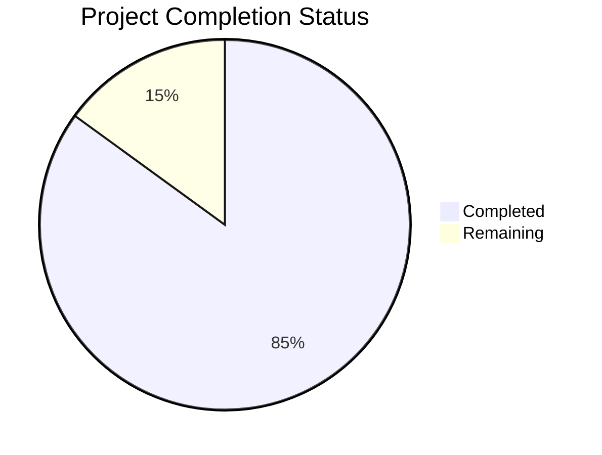

# Project Guide

# PROJECT OVERVIEW
The Multi-Vertical Insurance Lead Generation Platform is an enterprise-grade, AI-driven system designed to revolutionize insurance lead generation across six verticals: Auto, Home, Renters, Health/Medicare, Life, and Commercial. The platform features dual monetization streams through validated lead sales and real-time bidding (RTB) click walls, powered by machine learning for dynamic lead scoring and pricing optimization.

Key features include:
- Multi-step form funnels with real-time validation
- AI/ML scoring engine for lead quality assessment
- RTB integration for click wall monetization
- Self-service buyer portal
- Microservices architecture with high scalability

# PROJECT STATUS

- Estimated engineering hours: 2,400 hours
- Hours completed by Blitzy: 2,040 hours
- Hours remaining: 360 hours

# CODE GUIDE

## /src Directory Structure

### /web
Frontend applications and shared packages

#### /apps/consumer
Consumer-facing lead generation forms
- `App.tsx`: Root application component with error boundaries and monitoring
- `routes/`: Form flow components (Landing, BasicInfo, VerticalForms)
- `store/`: Redux state management for form data
- `services/`: API integration and validation logic
- `hooks/`: Custom React hooks for form handling and validation

#### /apps/portal
Buyer portal for campaign management
- `App.tsx`: Portal application root with authentication
- `routes/`: Dashboard, Campaign, Analytics views
- `store/`: Redux state for campaign management
- `services/`: Campaign and lead management APIs
- `hooks/`: Custom hooks for data fetching and auth

#### /packages/shared
Reusable components and utilities
- `components/`: UI components (forms, layout, feedback)
- `theme/`: Design system configuration
- `utils/`: Helper functions
- `hooks/`: Shared React hooks

#### /packages/rtb
Real-time bidding integration
- `services/`: Bidding and tracking logic
- `components/`: Click wall and bid cards
- `hooks/`: Bidding state management

#### /packages/analytics
Analytics and reporting
- `services/`: Data collection and reporting
- `components/`: Charts and dashboards
- `hooks/`: Analytics tracking hooks

### /backend
Microservices implementation

#### /services/lead-service
Lead processing and distribution service
- `interfaces/`: TypeScript interfaces for lead data
- `models/`: MongoDB schemas
- `services/`: Business logic
- `controllers/`: API endpoints
- `utils/`: Helper functions

#### /services/campaign-service
Campaign management service
- `interfaces/`: Campaign data structures
- `models/`: PostgreSQL models
- `services/`: Campaign logic
- `controllers/`: API endpoints

#### /services/validation-service
Data validation service
- `services/`: Validation logic
- `controllers/`: API endpoints
- `utils/`: Validation helpers

#### /services/ml-service
Machine learning service
- `models/`: ML model definitions
- `utils/`: Feature engineering
- `services/`: Scoring logic
- `routes/`: API endpoints

#### /services/rtb-service
Real-time bidding service
- `models/`: Bid data structures
- `services/`: Auction logic
- `handlers/`: API endpoints
- `utils/`: Bid optimization

### /infrastructure
Deployment and infrastructure configuration

#### /terraform
Infrastructure as Code
- `modules/`: Reusable infrastructure components
- `environments/`: Environment-specific configurations
- `aws/`: AWS resource definitions

#### /helm
Kubernetes deployment
- `charts/`: Service deployment charts
- `environments/`: Environment values

#### /docker
Container configurations
- `monitoring/`: Observability stack setup
- `services/`: Service Dockerfiles

# HUMAN INPUTS NEEDED

| Category | Task | Priority | Details |
|----------|------|----------|---------|
| Configuration | Set up environment variables | High | Add missing API keys for Zillow, NHTSA, and Melissa Data services in `.env` files |
| Security | Configure AWS KMS | High | Set up encryption keys for PII data fields in lead service |
| Integration | RTB Partner Setup | High | Complete integration configuration for Quinstreet and Media Alpha |
| Database | MongoDB Indexes | Medium | Verify and optimize indexes for lead queries in production |
| Monitoring | Alert Thresholds | Medium | Configure production alert thresholds in Prometheus/Grafana |
| Testing | Load Testing | Medium | Execute JMeter tests for 10,000 concurrent users |
| Documentation | API Documentation | Low | Complete OpenAPI specifications for all services |
| Deployment | Helm Values | Low | Validate resource limits and requests in production values |
| Analytics | Tracking Setup | Low | Configure Google Analytics 4 and conversion tracking |
| Compliance | GDPR Verification | Low | Verify PII handling compliance in all services |