# Technical Specifications

# 1. INTRODUCTION

## 1.1 EXECUTIVE SUMMARY

The Multi-Vertical Insurance Lead Generation Platform is an AI-driven system designed to revolutionize insurance lead generation across Auto, Home, Renters, Health/Medicare, Life, and Commercial verticals. The platform addresses the critical challenge of maximizing revenue from consumer insurance inquiries through dual monetization streams: validated lead sales and real-time bidding (RTB) click walls.

This enterprise-grade solution leverages machine learning to dynamically score and price leads while ensuring optimal monetization through either direct lead sales or RTB-powered click walls. The platform serves insurance carriers, agents, and aggregators seeking high-quality leads while providing consumers with a streamlined, mobile-first quote request experience.

## 1.2 SYSTEM OVERVIEW

### Project Context

| Aspect | Description |
|--------|-------------|
| Market Position | First-to-market AI-optimized multi-vertical insurance lead platform |
| Current Limitations | Existing solutions lack real-time scoring, dual monetization, and cross-vertical optimization |
| Enterprise Integration | Seamless integration with carrier systems, RTB networks, and third-party validation services |

### High-Level Description

The platform consists of these core components:

- Multi-step form funnels with real-time validation across six insurance verticals
- AI/ML scoring engine for lead quality assessment and pricing optimization
- RTB integration layer for click wall monetization
- Self-service buyer portal for campaign management
- Microservices architecture supporting high scalability and reliability

### Success Criteria

| Category | Target Metrics |
|----------|---------------|
| Lead Quality | >40% lead acceptance rate |
| Monetization | >25% revenue increase vs. traditional platforms |
| Performance | <500ms average response time |
| Scalability | Support 10,000+ concurrent users |
| Availability | 99.9% uptime SLA |

## 1.3 SCOPE

### In-Scope Elements

#### Core Features

| Feature Category | Components |
|-----------------|------------|
| Lead Generation | - Multi-vertical form funnels<br>- Real-time data validation<br>- Cross-sell optimization<br>- Partial lead recovery |
| AI/ML Operations | - Real-time lead scoring<br>- Dynamic pricing<br>- Behavioral analysis<br>- Continuous model refinement |
| Monetization | - Lead distribution system<br>- RTB click walls<br>- Exit-intent monetization |
| Campaign Management | - Self-service buyer portal<br>- Real-time analytics<br>- Budget management |

#### Implementation Boundaries

| Boundary Type | Coverage |
|--------------|----------|
| System | Cloud-based microservices architecture |
| Users | Consumers, Insurance Buyers, System Administrators |
| Geographic | United States market (all 50 states) |
| Data | Insurance application data, user behavior, transaction records |

### Out-of-Scope Elements

- Policy management and servicing
- Claims processing
- Direct consumer policy comparison tools
- Agent/carrier CRM functionality
- Payment processing systems
- International markets
- Non-insurance financial products
- Consumer-facing policy management portals

Future phase considerations include:
- Direct policy binding capabilities
- Advanced chatbot integration
- Multi-language support
- Expanded vertical coverage

# 2. SYSTEM ARCHITECTURE

## 2.1 High-Level Architecture

The Multi-Vertical Insurance Lead Generation Platform employs a microservices architecture deployed across multiple cloud availability zones for high reliability and scalability.

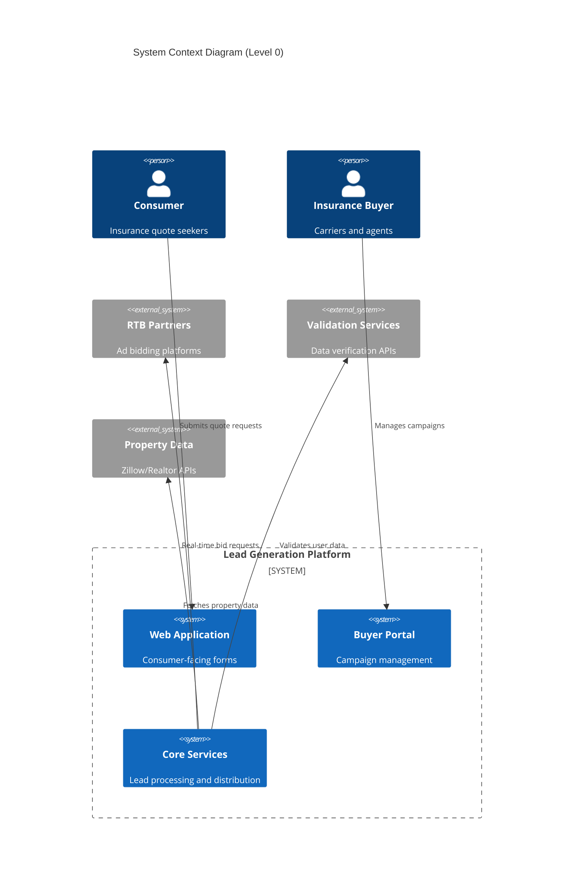
```mermaid
C4Context
    title System Context Diagram (Level 0)
    
    Person(consumer, "Consumer", "Insurance quote seekers")
    Person(buyer, "Insurance Buyer", "Carriers and agents")
    
    System_Boundary(platform, "Lead Generation Platform") {
        System(web, "Web Application", "Consumer-facing forms")
        System(buyer_portal, "Buyer Portal", "Campaign management")
        System(core, "Core Services", "Lead processing and distribution")
    }
    
    System_Ext(rtb, "RTB Partners", "Ad bidding platforms")
    System_Ext(validation, "Validation Services", "Data verification APIs")
    System_Ext(property, "Property Data", "Zillow/Realtor APIs")
    
    Rel(consumer, web, "Submits quote requests")
    Rel(buyer, buyer_portal, "Manages campaigns")
    Rel(core, rtb, "Real-time bid requests")
    Rel(core, validation, "Validates user data")
    Rel(core, property, "Fetches property data")
```

### Container Architecture (Level 1)

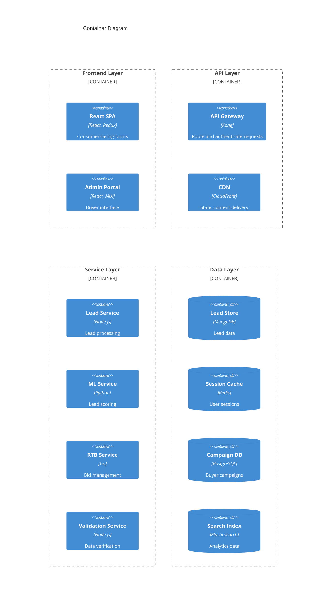
```mermaid
C4Container
    title Container Diagram
    
    Container_Boundary(frontend, "Frontend Layer") {
        Container(spa, "React SPA", "React, Redux", "Consumer-facing forms")
        Container(admin, "Admin Portal", "React, MUI", "Buyer interface")
    }
    
    Container_Boundary(api, "API Layer") {
        Container(gateway, "API Gateway", "Kong", "Route and authenticate requests")
        Container(cdn, "CDN", "CloudFront", "Static content delivery")
    }
    
    Container_Boundary(services, "Service Layer") {
        Container(lead, "Lead Service", "Node.js", "Lead processing")
        Container(ml, "ML Service", "Python", "Lead scoring")
        Container(rtb, "RTB Service", "Go", "Bid management")
        Container(validation, "Validation Service", "Node.js", "Data verification")
    }
    
    Container_Boundary(data, "Data Layer") {
        ContainerDb(mongo, "Lead Store", "MongoDB", "Lead data")
        ContainerDb(redis, "Session Cache", "Redis", "User sessions")
        ContainerDb(postgres, "Campaign DB", "PostgreSQL", "Buyer campaigns")
        ContainerDb(elastic, "Search Index", "Elasticsearch", "Analytics data")
    }
```

## 2.2 Component Details

### Core Components

| Component | Technology | Purpose | Scaling Strategy |
|-----------|------------|---------|------------------|
| Form Engine | React/Redux | Dynamic form rendering and validation | Horizontal via K8s |
| Lead Service | Node.js/Express | Lead processing and distribution | Horizontal + Queue-based |
| ML Service | Python/FastAPI | Real-time lead scoring | GPU-enabled instances |
| RTB Service | Go | Bid aggregation and optimization | Event-driven scaling |
| Validation Service | Node.js | Data verification and enrichment | Auto-scaling groups |

### Data Flow Architecture

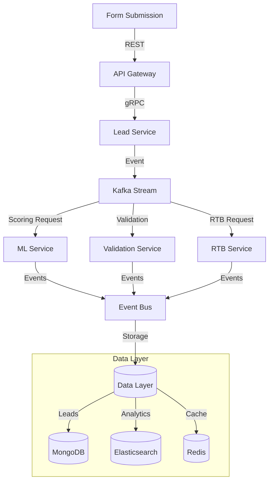
```mermaid
flowchart TD
    A[Form Submission] -->|REST| B[API Gateway]
    B -->|gRPC| C[Lead Service]
    C -->|Event| D[Kafka Stream]
    
    D -->|Scoring Request| E[ML Service]
    D -->|Validation| F[Validation Service]
    D -->|RTB Request| G[RTB Service]
    
    E & F & G -->|Events| H[Event Bus]
    H -->|Storage| I[(Data Layer)]
    
    subgraph "Data Layer"
        I -->|Leads| J[(MongoDB)]
        I -->|Analytics| K[(Elasticsearch)]
        I -->|Cache| L[(Redis)]
    end
```

## 2.3 Technical Decisions

### Architecture Choices

| Decision | Rationale | Benefits |
|----------|-----------|-----------|
| Microservices | Independent scaling and deployment | Improved reliability and maintainability |
| Event-Driven | Asynchronous processing for high throughput | Better performance under load |
| Polyglot Persistence | Optimized storage per data type | Enhanced data access patterns |
| API Gateway | Centralized routing and security | Simplified client integration |
| Container Orchestration | Dynamic resource allocation | Efficient resource utilization |

### Storage Solutions

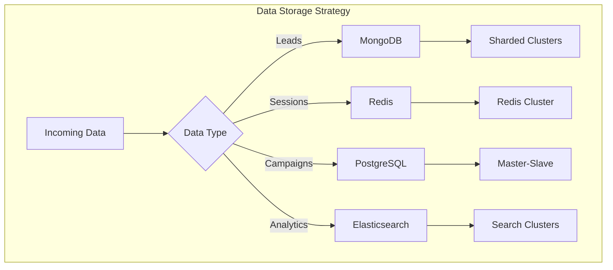
```mermaid
graph TD
    subgraph "Data Storage Strategy"
        A[Incoming Data] --> B{Data Type}
        B -->|Leads| C[MongoDB]
        B -->|Sessions| D[Redis]
        B -->|Campaigns| E[PostgreSQL]
        B -->|Analytics| F[Elasticsearch]
        
        C --> G[Sharded Clusters]
        D --> H[Redis Cluster]
        E --> I[Master-Slave]
        F --> J[Search Clusters]
    end
```

## 2.4 Cross-Cutting Concerns

### Monitoring Architecture

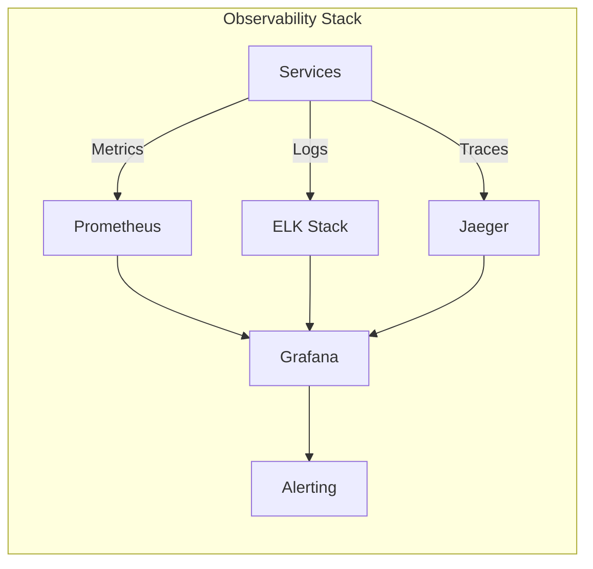
```mermaid
flowchart LR
    subgraph "Observability Stack"
        A[Services] -->|Metrics| B[Prometheus]
        A -->|Logs| C[ELK Stack]
        A -->|Traces| D[Jaeger]
        
        B & C & D --> E[Grafana]
        E --> F[Alerting]
    end
```

### Security Architecture

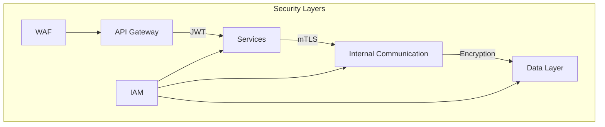
```mermaid
flowchart TD
    subgraph "Security Layers"
        A[WAF] --> B[API Gateway]
        B -->|JWT| C[Services]
        C -->|mTLS| D[Internal Communication]
        D -->|Encryption| E[Data Layer]
        
        F[IAM] --> C & D & E
    end
```

## 2.5 Deployment Architecture

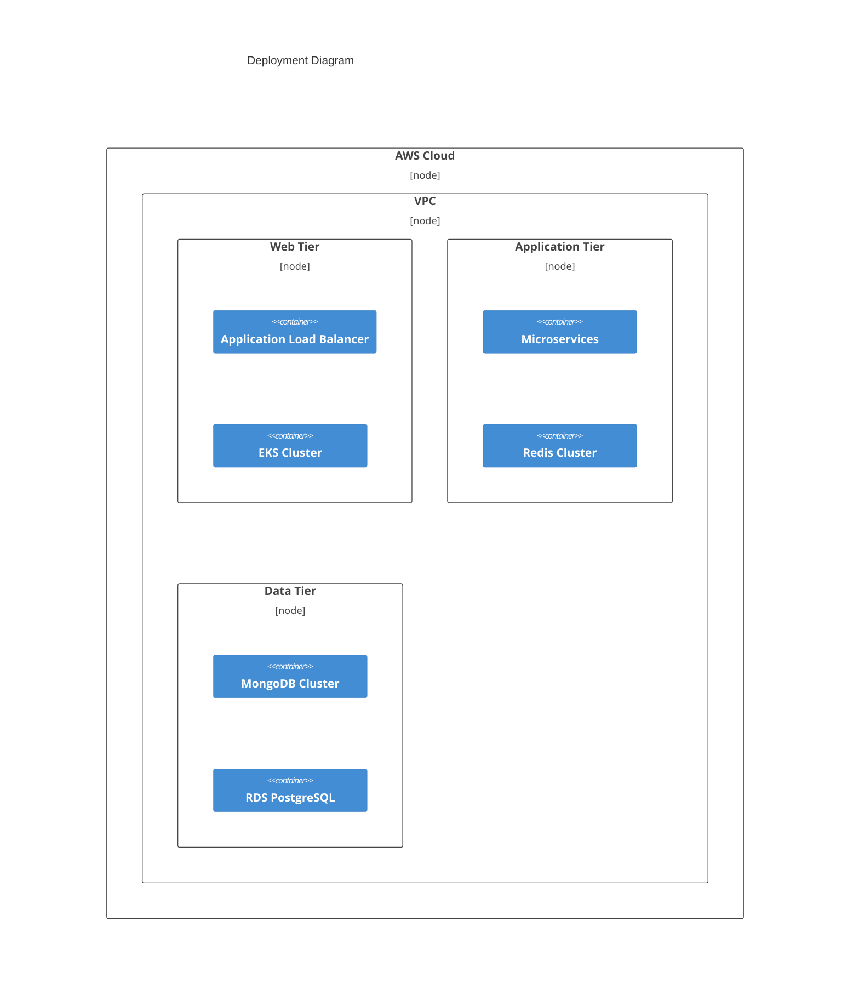
```mermaid
C4Deployment
    title Deployment Diagram
    
    Deployment_Node(aws, "AWS Cloud") {
        Deployment_Node(vpc, "VPC") {
            Deployment_Node(web, "Web Tier") {
                Container(alb, "Application Load Balancer")
                Container(eks, "EKS Cluster")
            }
            
            Deployment_Node(app, "Application Tier") {
                Container(services, "Microservices")
                Container(cache, "Redis Cluster")
            }
            
            Deployment_Node(data, "Data Tier") {
                Container(mongo, "MongoDB Cluster")
                Container(rds, "RDS PostgreSQL")
            }
        }
    }
```

### Disaster Recovery Strategy

| Component | Recovery Strategy | RPO | RTO |
|-----------|------------------|-----|-----|
| Lead Data | Multi-region replication | 0 min | 5 min |
| User Sessions | Cross-AZ redundancy | 1 min | 2 min |
| Campaign Data | Automated failover | 5 min | 15 min |
| ML Models | Version-controlled snapshots | 1 hour | 30 min |

# 3. SYSTEM COMPONENTS ARCHITECTURE

## 3.1 USER INTERFACE DESIGN

### 3.1.1 Design System Specifications

| Component | Specification | Requirements |
|-----------|--------------|--------------|
| Typography | System Font Stack | -1rem base size<br>-1.5 line height<br>-Font weights: 400, 500, 700 |
| Color Palette | Insurance-Vertical Specific | -Auto: Blue (#1976D2)<br>-Home: Green (#2E7D32)<br>-Health: Red (#D32F2F)<br>-Life: Purple (#7B1FA2) |
| Spacing System | 8px Base Grid | -Margins: 8px, 16px, 24px, 32px<br>-Padding: 8px, 16px, 24px |
| Breakpoints | Mobile-First | -Mobile: 0-767px<br>-Tablet: 768-1023px<br>-Desktop: 1024px+ |
| Accessibility | WCAG 2.1 AA | -Contrast ratio ≥ 4.5:1<br>-Focus indicators<br>-ARIA labels |

### 3.1.2 Form Flow Architecture

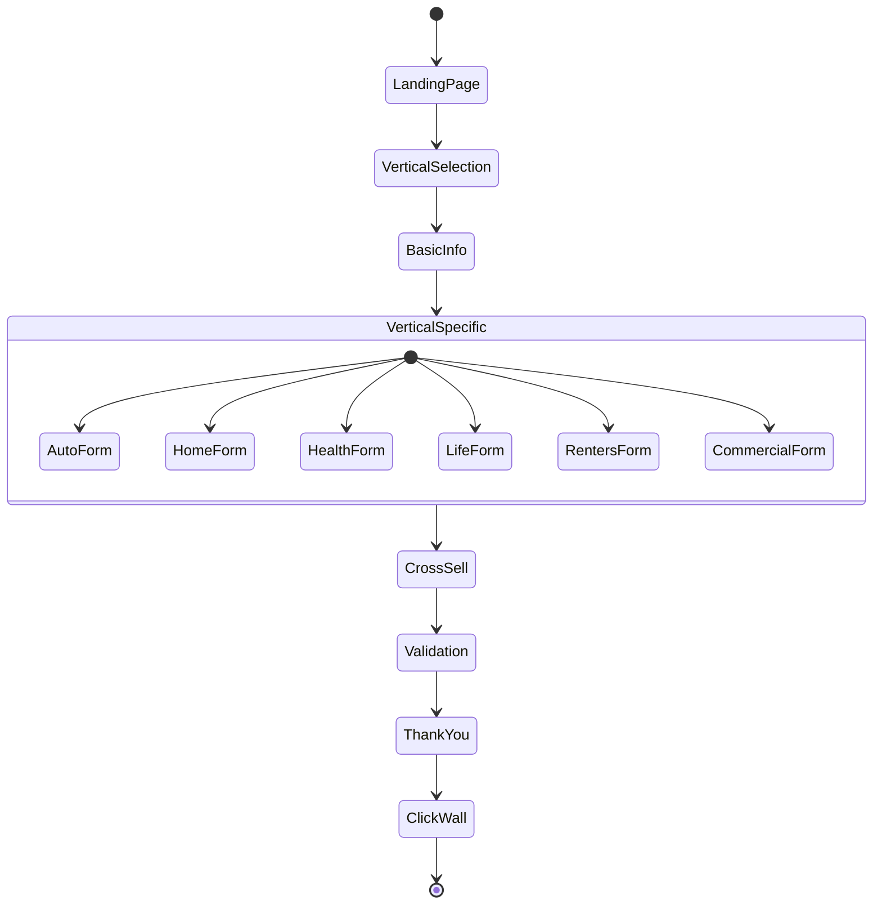
```mermaid
stateDiagram-v2
    [*] --> LandingPage
    LandingPage --> VerticalSelection
    VerticalSelection --> BasicInfo
    BasicInfo --> VerticalSpecific
    VerticalSpecific --> CrossSell
    CrossSell --> Validation
    Validation --> ThankYou
    ThankYou --> ClickWall
    ClickWall --> [*]
    
    state VerticalSpecific {
        [*] --> AutoForm
        [*] --> HomeForm
        [*] --> HealthForm
        [*] --> LifeForm
        [*] --> RentersForm
        [*] --> CommercialForm
    }
```

### 3.1.3 Component Library

| Component | Variants | States | Accessibility |
|-----------|----------|--------|---------------|
| Form Input | Text, Select, Radio, Checkbox | Default, Focus, Error, Disabled | aria-invalid, aria-describedby |
| Progress Bar | Linear, Step Indicator | Active, Complete, Error | aria-valuenow, aria-valuemax |
| Click Card | Standard, Featured | Default, Hover, Selected | role="button", aria-pressed |
| Validation Message | Success, Error, Warning | Visible, Hidden | role="alert", aria-live |
| Loading State | Skeleton, Spinner | Active, Complete | aria-busy, aria-hidden |

## 3.2 DATABASE DESIGN

### 3.2.1 Core Schema

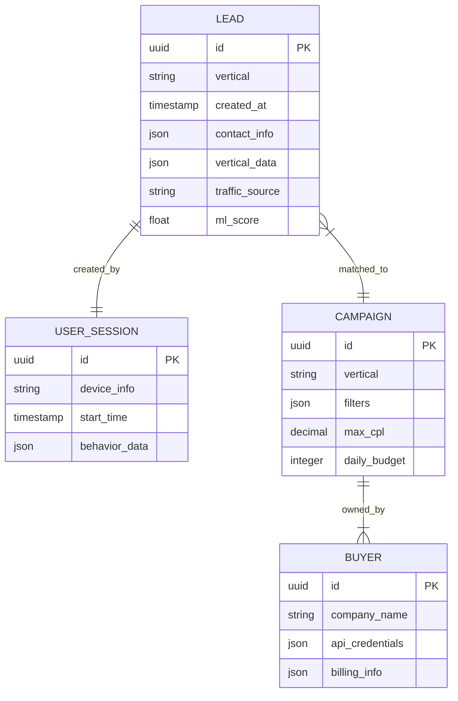
```mermaid
erDiagram
    LEAD {
        uuid id PK
        string vertical
        timestamp created_at
        json contact_info
        json vertical_data
        string traffic_source
        float ml_score
    }
    
    USER_SESSION {
        uuid id PK
        string device_info
        timestamp start_time
        json behavior_data
    }
    
    CAMPAIGN {
        uuid id PK
        string vertical
        json filters
        decimal max_cpl
        integer daily_budget
    }
    
    BUYER {
        uuid id PK
        string company_name
        json api_credentials
        json billing_info
    }
    
    LEAD ||--|| USER_SESSION : "created_by"
    LEAD }|--|| CAMPAIGN : "matched_to"
    CAMPAIGN ||--|{ BUYER : "owned_by"
```

### 3.2.2 Partitioning Strategy

| Entity | Partition Key | Partition Strategy | Retention |
|--------|--------------|-------------------|------------|
| Leads | vertical + created_date | Monthly partitions | 90 days active, 7 years archived |
| Sessions | start_date | Daily partitions | 30 days |
| Campaigns | buyer_id + status | List partitioning | Indefinite |
| Click Events | event_date | Daily partitions | 180 days |

### 3.2.3 Index Design

| Table | Index Type | Columns | Purpose |
|-------|------------|---------|---------|
| leads | B-tree | (vertical, ml_score) | Campaign matching |
| leads | Hash | session_id | Session lookup |
| campaigns | B-tree | (vertical, status, max_cpl) | Lead distribution |
| click_events | BRIN | created_at | Time-series queries |

## 3.3 API DESIGN

### 3.3.1 API Architecture

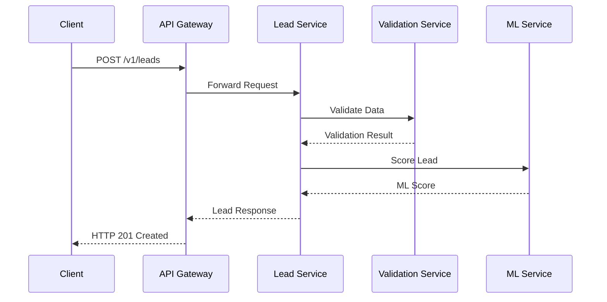
```mermaid
sequenceDiagram
    participant C as Client
    participant G as API Gateway
    participant L as Lead Service
    participant V as Validation Service
    participant M as ML Service
    
    C->>G: POST /v1/leads
    G->>L: Forward Request
    L->>V: Validate Data
    V-->>L: Validation Result
    L->>M: Score Lead
    M-->>L: ML Score
    L-->>G: Lead Response
    G-->>C: HTTP 201 Created
```

### 3.3.2 API Endpoints

| Endpoint | Method | Purpose | Rate Limit |
|----------|--------|---------|------------|
| /v1/leads | POST | Create new lead | 100/min |
| /v1/campaigns | GET | List buyer campaigns | 1000/hour |
| /v1/validation | POST | Validate lead data | 200/min |
| /v1/clicks | POST | Record click events | 500/min |

### 3.3.3 Integration Patterns

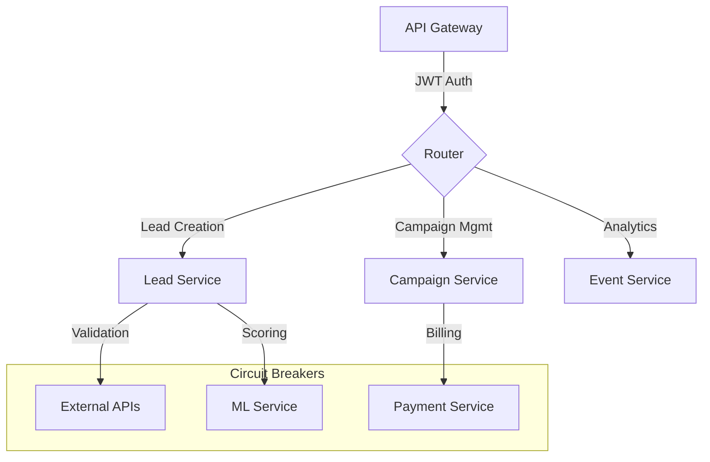
```mermaid
flowchart TD
    A[API Gateway] -->|JWT Auth| B{Router}
    B -->|Lead Creation| C[Lead Service]
    B -->|Campaign Mgmt| D[Campaign Service]
    B -->|Analytics| E[Event Service]
    
    C -->|Validation| F[External APIs]
    C -->|Scoring| G[ML Service]
    D -->|Billing| H[Payment Service]
    
    subgraph "Circuit Breakers"
        F
        G
        H
    end
```

### 3.3.4 Security Controls

| Layer | Control | Implementation |
|-------|---------|----------------|
| Transport | TLS 1.3 | Mandatory HTTPS |
| Authentication | OAuth 2.0 + JWT | Bearer tokens |
| Authorization | RBAC | JWT claims |
| Rate Limiting | Token bucket | Per-client limits |
| Input Validation | JSON Schema | Request validation |
| Audit | Event logging | All API requests |

# 4. TECHNOLOGY STACK

## 4.1 PROGRAMMING LANGUAGES

| Layer | Language | Version | Justification |
|-------|----------|---------|---------------|
| Frontend | TypeScript | 5.0+ | Type safety, enhanced IDE support, reduced runtime errors |
| Lead Service | Node.js | 20 LTS | High throughput, excellent async I/O for real-time processing |
| ML Service | Python | 3.11+ | Rich ML libraries, scientific computing ecosystem |
| RTB Service | Go | 1.21+ | Low latency, high concurrency for bid processing |
| Validation Service | Node.js | 20 LTS | Efficient API integrations, shared code with lead service |

## 4.2 FRAMEWORKS & LIBRARIES

### Frontend Framework Stack

| Component | Technology | Version | Purpose |
|-----------|------------|---------|----------|
| Core Framework | React | 18.2+ | Component-based architecture, virtual DOM efficiency |
| State Management | Redux Toolkit | 2.0+ | Centralized state, RTK Query for API integration |
| Form Management | React Hook Form | 7.0+ | Performance-optimized form handling |
| UI Components | Material-UI | 5.0+ | Enterprise-grade component library |
| Data Visualization | D3.js | 7.0+ | Custom analytics visualizations |

### Backend Framework Stack

| Service | Framework | Version | Justification |
|---------|-----------|---------|---------------|
| Lead Service | Express.js | 4.18+ | Mature ecosystem, middleware support |
| ML Service | FastAPI | 0.100+ | High performance async, auto-documentation |
| RTB Service | Gin | 1.9+ | Minimal overhead for bid processing |
| Validation | Express.js | 4.18+ | Consistent with lead service |

## 4.3 DATABASES & STORAGE

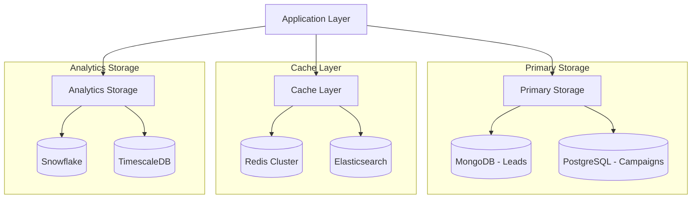
```mermaid
graph TD
    A[Application Layer] --> B[Primary Storage]
    A --> C[Cache Layer]
    A --> D[Analytics Storage]
    
    subgraph "Primary Storage"
        B --> E[(MongoDB - Leads)]
        B --> F[(PostgreSQL - Campaigns)]
    end
    
    subgraph "Cache Layer"
        C --> G[(Redis Cluster)]
        C --> H[(Elasticsearch)]
    end
    
    subgraph "Analytics Storage"
        D --> I[(Snowflake)]
        D --> J[(TimescaleDB)]
    end
```

| Storage Type | Technology | Version | Purpose |
|--------------|------------|---------|----------|
| Lead Store | MongoDB | 6.0+ | Flexible schema for varied lead types |
| Campaign DB | PostgreSQL | 15+ | ACID compliance for financial data |
| Session Cache | Redis | 7.0+ | High-performance user session storage |
| Search Index | Elasticsearch | 8.0+ | Full-text search, analytics |
| Data Warehouse | Snowflake | Enterprise | ML training data, analytics |
| Time Series | TimescaleDB | 2.11+ | Performance metrics, monitoring |

## 4.4 THIRD-PARTY SERVICES

### Integration Services

| Category | Service | Integration Method | Purpose |
|----------|---------|-------------------|----------|
| Property Data | Zillow API | REST/GraphQL | Real estate data enrichment |
| Vehicle Data | NHTSA API | REST | VIN validation and lookup |
| Contact Validation | Melissa Data | REST | Email/phone verification |
| RTB Partners | Quinstreet/Media Alpha | WebSocket | Real-time bid processing |

### Cloud Services (AWS)

| Service | Purpose | Configuration |
|---------|----------|--------------|
| EKS | Container orchestration | Multi-AZ deployment |
| RDS | Managed PostgreSQL | Multi-AZ with read replicas |
| DocumentDB | Managed MongoDB | Sharded clusters |
| ElastiCache | Redis management | Multi-AZ cluster |
| CloudFront | CDN | Edge optimization |

## 4.5 DEVELOPMENT & DEPLOYMENT

### Development Pipeline

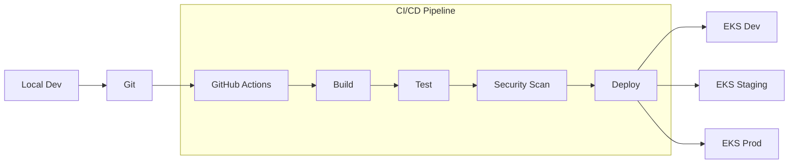
```mermaid
flowchart LR
    A[Local Dev] --> B[Git]
    B --> C[GitHub Actions]
    
    subgraph "CI/CD Pipeline"
        C --> D[Build]
        D --> E[Test]
        E --> F[Security Scan]
        F --> G[Deploy]
    end
    
    G --> H[EKS Dev]
    G --> I[EKS Staging]
    G --> J[EKS Prod]
```

### Infrastructure Tools

| Category | Tool | Version | Purpose |
|----------|------|---------|----------|
| IaC | Terraform | 1.5+ | Infrastructure provisioning |
| Containers | Docker | 24+ | Application containerization |
| Orchestration | Kubernetes | 1.27+ | Container management |
| Service Mesh | Istio | 1.19+ | Microservice communication |
| Monitoring | Prometheus/Grafana | Latest | Observability stack |
| Log Management | ELK Stack | 8.0+ | Centralized logging |

### Development Tools

| Tool | Version | Purpose |
|------|---------|----------|
| VS Code | Latest | Primary IDE |
| ESLint | 8.0+ | Code quality |
| Jest | 29+ | Unit testing |
| Cypress | 13+ | E2E testing |
| SonarQube | Latest | Code analysis |
| Artifactory | Latest | Package management |

# 5. SYSTEM DESIGN

## 5.1 USER INTERFACE DESIGN

### 5.1.1 Consumer Form Flow

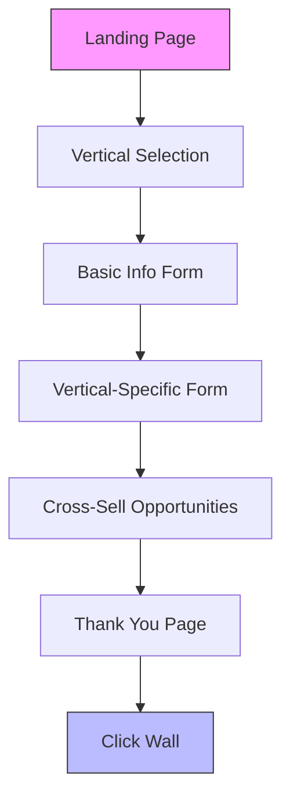
```mermaid
graph TD
    A[Landing Page] --> B[Vertical Selection]
    B --> C[Basic Info Form]
    C --> D[Vertical-Specific Form]
    D --> E[Cross-Sell Opportunities]
    E --> F[Thank You Page]
    F --> G[Click Wall]

    style A fill:#f9f,stroke:#333
    style G fill:#bbf,stroke:#333
```

#### Landing Page Layout

```
+------------------+
|    Header Logo   |
+------------------+
| Hero Image       |
| Value Prop Text  |
+------------------+
| Insurance Types  |
| [Auto] [Home]    |
| [Life] [Health]  |
+------------------+
| Trust Indicators |
+------------------+
```

#### Form Step Layout

```
+------------------+
| Progress Bar     |
+------------------+
| Step Title       |
| Help Text        |
+------------------+
| Form Fields      |
| [ Input 1    ]   |
| [ Input 2    ]   |
+------------------+
| [Back] [Next]    |
+------------------+
```

### 5.1.2 Buyer Portal Layout

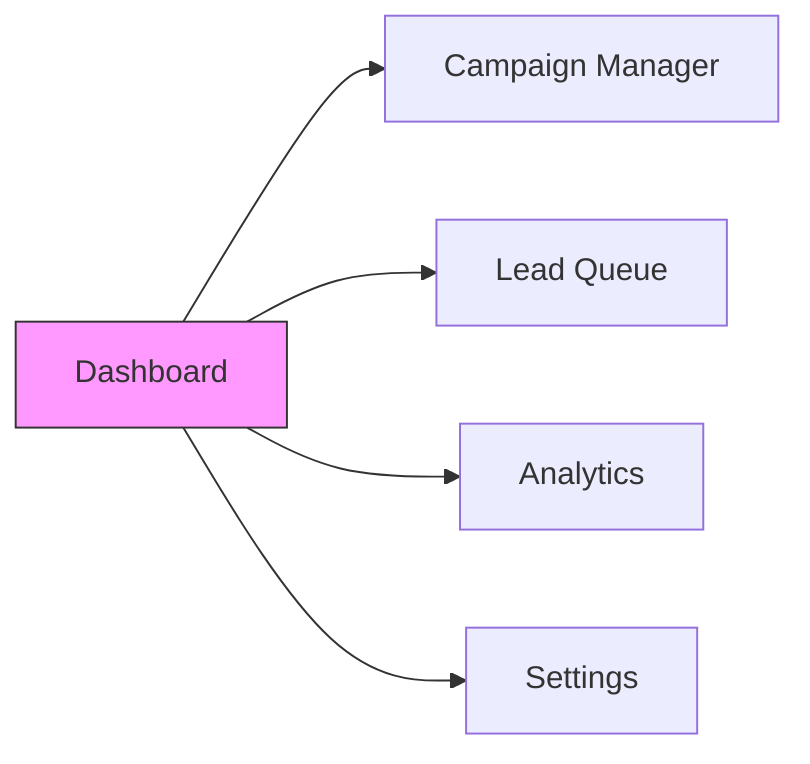
```mermaid
graph LR
    A[Dashboard] --> B[Campaign Manager]
    A --> C[Lead Queue]
    A --> D[Analytics]
    A --> E[Settings]

    style A fill:#f9f,stroke:#333
```

#### Dashboard Layout

```
+------------------+
| Nav Bar          |
+------------------+
| KPI Cards        |
|  [   ]  [   ]   |
|  [   ]  [   ]   |
+------------------+
| Lead Volume Chart|
+------------------+
| Active Campaigns |
+------------------+
```

## 5.2 DATABASE DESIGN

### 5.2.1 Core Schema Design

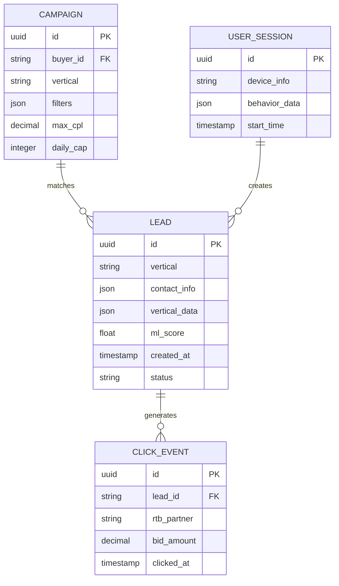
```mermaid
erDiagram
    LEAD {
        uuid id PK
        string vertical
        json contact_info
        json vertical_data
        float ml_score
        timestamp created_at
        string status
    }
    
    CAMPAIGN {
        uuid id PK
        string buyer_id FK
        string vertical
        json filters
        decimal max_cpl
        integer daily_cap
    }
    
    CLICK_EVENT {
        uuid id PK
        string lead_id FK
        string rtb_partner
        decimal bid_amount
        timestamp clicked_at
    }
    
    USER_SESSION {
        uuid id PK
        string device_info
        json behavior_data
        timestamp start_time
    }

    LEAD ||--o{ CLICK_EVENT : generates
    CAMPAIGN ||--o{ LEAD : matches
    USER_SESSION ||--o{ LEAD : creates
```

### 5.2.2 Sharding Strategy

| Shard Key | Collection | Justification |
|-----------|------------|---------------|
| vertical + created_date | leads | Even distribution, efficient queries by insurance type |
| buyer_id | campaigns | Localized buyer data access |
| lead_id | click_events | Co-location with parent lead |
| created_date | user_sessions | Time-based partitioning |

### 5.2.3 Index Design

| Collection | Index | Type | Purpose |
|------------|-------|------|---------|
| leads | {vertical: 1, ml_score: -1} | Compound | Campaign matching |
| leads | {created_at: 1} | Single | Time-based queries |
| campaigns | {buyer_id: 1, status: 1} | Compound | Active campaign lookup |
| click_events | {lead_id: 1, clicked_at: 1} | Compound | Click tracking |

## 5.3 API DESIGN

### 5.3.1 RESTful Endpoints

| Endpoint | Method | Purpose | Request Body | Response |
|----------|--------|---------|--------------|-----------|
| /api/v1/leads | POST | Create new lead | Lead data | Lead ID + status |
| /api/v1/leads/{id} | GET | Retrieve lead | - | Lead details |
| /api/v1/campaigns | POST | Create campaign | Campaign config | Campaign ID |
| /api/v1/clicks | POST | Record click | Click data | Click ID |

### 5.3.2 Service Communication

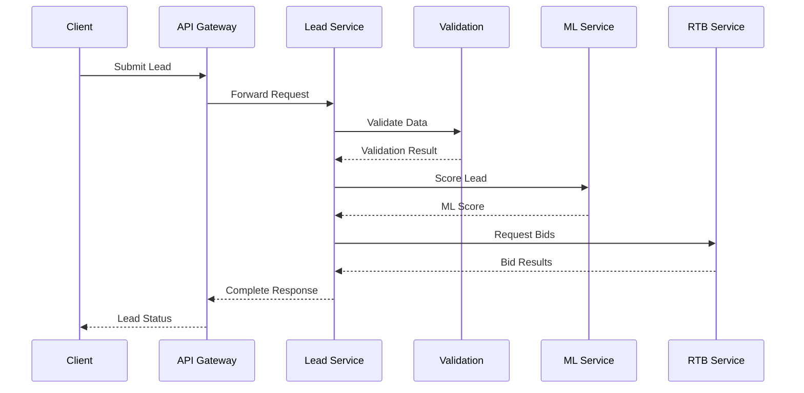
```mermaid
sequenceDiagram
    participant C as Client
    participant G as API Gateway
    participant L as Lead Service
    participant V as Validation
    participant M as ML Service
    participant R as RTB Service

    C->>G: Submit Lead
    G->>L: Forward Request
    L->>V: Validate Data
    V-->>L: Validation Result
    L->>M: Score Lead
    M-->>L: ML Score
    L->>R: Request Bids
    R-->>L: Bid Results
    L-->>G: Complete Response
    G-->>C: Lead Status
```

### 5.3.3 WebSocket Events

| Event | Direction | Payload | Purpose |
|-------|-----------|---------|----------|
| lead.created | Server→Client | Lead ID | Real-time lead notifications |
| bid.received | Server→Client | Bid data | RTB updates |
| session.update | Client→Server | Session data | User behavior tracking |
| campaign.update | Server→Client | Campaign status | Real-time campaign updates |

### 5.3.4 Error Handling

| Error Code | Description | Resolution |
|------------|-------------|------------|
| 4001 | Invalid lead data | Validation errors returned |
| 4002 | Campaign limit reached | Retry next day |
| 5001 | ML service unavailable | Fallback scoring |
| 5002 | RTB timeout | Skip bid process |

## 5.4 SECURITY DESIGN

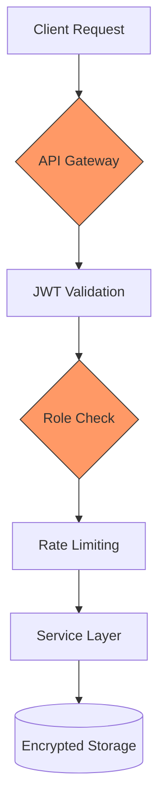
```mermaid
flowchart TD
    A[Client Request] --> B{API Gateway}
    B --> C[JWT Validation]
    C --> D{Role Check}
    D --> E[Rate Limiting]
    E --> F[Service Layer]
    F --> G[(Encrypted Storage)]

    style B fill:#f96,stroke:#333
    style D fill:#f96,stroke:#333
```

### 5.4.1 Authentication Flow

| Layer | Method | Implementation |
|-------|---------|---------------|
| Client | OAuth 2.0 | JWT tokens |
| Service | mTLS | Certificate-based |
| Database | IAM | Role-based access |
| RTB | API Keys | Partner-specific keys |

### 5.4.2 Data Protection

| Data Type | Protection Method | Access Control |
|-----------|------------------|----------------|
| PII | Field-level encryption | Role-based |
| Sessions | Redis encryption | Service-level |
| Credentials | AWS KMS | IAM policies |
| Audit Logs | Immutable storage | Read-only access |

# 6. USER INTERFACE DESIGN

## 6.1 Common Components & Style Guide

### Icon Key
```
[?] - Help/Info tooltip
[$] - Payment/Financial
[i] - Information
[+] - Add/Create new
[x] - Close/Delete
[<] [>] - Navigation
[^] - Upload
[#] - Menu/Dashboard
[@] - User/Profile
[!] - Warning/Alert
[=] - Settings
[*] - Important/Favorite
```

### Input Elements
```
[ ] - Checkbox
( ) - Radio button
[...] - Text input field
[v] - Dropdown menu
[====] - Progress bar
[Button] - Action button
```

## 6.2 Consumer Lead Flow

### 6.2.1 Landing Page
```
+------------------------------------------+
|           Insurance Quotes [?]            |
+------------------------------------------+
|                                          |
|    Select Your Insurance Type:           |
|                                          |
|    +-------------+    +-------------+    |
|    |    Auto     |    |    Home    |    |
|    +-------------+    +-------------+    |
|                                          |
|    +-------------+    +-------------+    |
|    |   Health    |    |    Life    |    |
|    +-------------+    +-------------+    |
|                                          |
|    +-------------+    +-------------+    |
|    |   Renters   |    | Commercial |    |
|    +-------------+    +-------------+    |
|                                          |
|    [============================] 1/5    |
|                                          |
|              [Next Step >]               |
+------------------------------------------+
```

### 6.2.2 Basic Information Form
```
+------------------------------------------+
|    Basic Information            [x] [?]   |
+------------------------------------------+
|                                          |
| Full Name:                               |
| [..................................]     |
|                                          |
| Email: [!]                               |
| [..................................]     |
|                                          |
| Phone:                                   |
| [..................................]     |
|                                          |
| ZIP Code:                                |
| [..........]                             |
|                                          |
| [============================] 2/5        |
|                                          |
| [< Back]                   [Continue >]  |
+------------------------------------------+
```

### 6.2.3 Auto Insurance Form
```
+------------------------------------------+
|    Vehicle Information         [x] [?]    |
+------------------------------------------+
|                                          |
| Vehicle Year:                            |
| [v] Select Year                          |
|                                          |
| Make:                                    |
| [v] Select Make                          |
|                                          |
| Model:                                   |
| [v] Select Model                         |
|                                          |
| VIN (Optional):                          |
| [..................................]     |
|                                          |
| Primary Use:                             |
| ( ) Personal                             |
| ( ) Business                             |
| ( ) Rideshare                            |
|                                          |
| [============================] 3/5        |
|                                          |
| [< Back]                   [Continue >]  |
+------------------------------------------+
```

## 6.3 Click Wall Design

### 6.3.1 Thank You Page with Click Wall
```
+------------------------------------------+
|    Thank You!                    [x]      |
+------------------------------------------+
|                                          |
|  [i] Your quotes are being prepared      |
|                                          |
|  Compare More Options:                   |
|  +----------------+  +----------------+  |
|  | [$] Carrier 1  |  | [$] Carrier 2  |  |
|  | Save 20% Now   |  | Best Rates     |  |
|  | [View Quote]   |  | [View Quote]   |  |
|  +----------------+  +----------------+  |
|                                          |
|  +----------------+  +----------------+  |
|  | [$] Carrier 3  |  | [$] Carrier 4  |  |
|  | Bundle & Save  |  | Compare Now    |  |
|  | [View Quote]   |  | [View Quote]   |  |
|  +----------------+  +----------------+  |
|                                          |
+------------------------------------------+
```

## 6.4 Buyer Portal

### 6.4.1 Dashboard
```
+------------------------------------------+
|  [@] Admin Portal           [=] [?] [x]  |
+------------------------------------------+
|  [#] Menu                                |
|  +----------------+  +----------------+  |
|  | Active Leads   |  | Daily Spend    |  |
|  | 1,234          |  | $12,345       |  |
|  +----------------+  +----------------+  |
|  +----------------+  +----------------+  |
|  | Conversion     |  | Lead Quality   |  |
|  | 32%            |  | [====] 85%     |  |
|  +----------------+  +----------------+  |
|                                          |
|  Recent Activity                         |
|  +------------------------------------+ |
|  | Time    | Type  | Status    | Cost | |
|  |---------|-------|-----------|------| |
|  | 10:45AM | Auto  | Accepted  | $24  | |
|  | 10:30AM | Home  | Pending   | $31  | |
|  | 10:15AM | Life  | Rejected  | $0   | |
|  +------------------------------------+ |
|                                          |
|  [< Prev]  Page 1 of 5  [Next >]        |
+------------------------------------------+
```

### 6.4.2 Campaign Manager
```
+------------------------------------------+
|  Campaign Settings           [=] [?] [x]  |
+------------------------------------------+
|                                          |
| Campaign Name:                           |
| [..................................]     |
|                                          |
| Insurance Type:                          |
| [v] Select Type                          |
|                                          |
| Daily Budget:                            |
| [$] [..............]                     |
|                                          |
| Lead Filters:                            |
| [+] Add Filter                           |
| +----------------------------------+     |
| | State: [v] CA, NY, FL            |     |
| | Credit: [v] Good, Excellent      |     |
| | Age: [v] 25-65                   |     |
| +----------------------------------+     |
|                                          |
| [ ] Activate Real-time Notifications     |
|                                          |
| [Save Campaign]    [Test Campaign]       |
+------------------------------------------+
```

## 6.5 Mobile Responsive Layouts

### 6.5.1 Mobile Form View
```
+----------------------+
|   Insurance Quote    |
|   [=]         [x]   |
+----------------------+
|                      |
| Step 2 of 5          |
| [==============]     |
|                      |
| Contact Info:        |
| [...................]|
|                      |
| Email:               |
| [...................]|
|                      |
| Phone:               |
| [...................]|
|                      |
| [Continue >]         |
+----------------------+
```

### 6.5.2 Mobile Click Wall
```
+----------------------+
|     Best Offers      |
|   [=]         [x]   |
+----------------------+
|  +----------------+ |
|  | [$] Carrier 1   | |
|  | Save Now!       | |
|  | [View Quote]    | |
|  +----------------+ |
|                      |
|  +----------------+ |
|  | [$] Carrier 2   | |
|  | Best Value      | |
|  | [View Quote]    | |
|  +----------------+ |
|                      |
| [Show More v]        |
+----------------------+
```

# 7. SECURITY CONSIDERATIONS

## 7.1 AUTHENTICATION AND AUTHORIZATION

### Authentication Methods

| User Type | Primary Method | Secondary Method | Session Duration |
|-----------|----------------|------------------|------------------|
| Consumers | Anonymous with session token | Email verification for partial leads | 30 minutes |
| Buyers | OAuth 2.0 + JWT | TOTP 2FA (required) | 8 hours |
| Administrators | OAuth 2.0 + JWT | Hardware key (required) | 4 hours |
| API Partners | mTLS | API key + JWT | Key rotation every 30 days |

### Role-Based Access Control (RBAC)

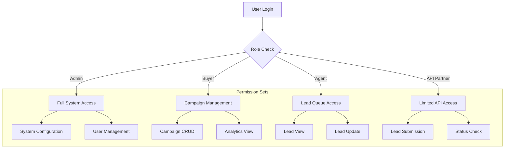
```mermaid
graph TD
    A[User Login] --> B{Role Check}
    B -->|Admin| C[Full System Access]
    B -->|Buyer| D[Campaign Management]
    B -->|Agent| E[Lead Queue Access]
    B -->|API Partner| F[Limited API Access]
    
    subgraph "Permission Sets"
        C --> G[System Configuration]
        C --> H[User Management]
        D --> I[Campaign CRUD]
        D --> J[Analytics View]
        E --> K[Lead View]
        E --> L[Lead Update]
        F --> M[Lead Submission]
        F --> N[Status Check]
    end
```

## 7.2 DATA SECURITY

### Data Classification

| Data Type | Classification | Storage Requirements | Transit Requirements |
|-----------|---------------|---------------------|---------------------|
| PII (Name, SSN) | Highly Sensitive | AES-256 encryption at rest | TLS 1.3 |
| Contact Info | Sensitive | AES-256 encryption at rest | TLS 1.3 |
| Insurance Details | Confidential | Encrypted in MongoDB | TLS 1.3 |
| Analytics Data | Internal | Standard database security | TLS 1.2+ |
| Public Content | Public | No encryption required | HTTPS |

### Encryption Architecture

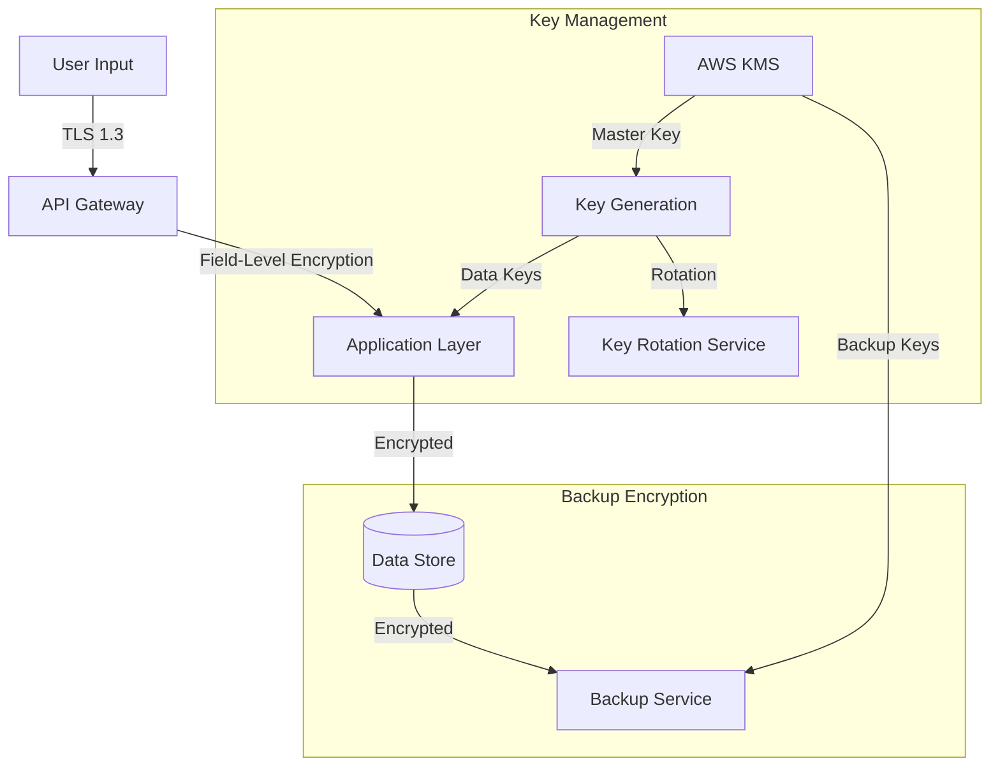
```mermaid
flowchart TD
    A[User Input] -->|TLS 1.3| B[API Gateway]
    B -->|Field-Level Encryption| C[Application Layer]
    C -->|Encrypted| D[(Data Store)]
    
    subgraph "Key Management"
        E[AWS KMS] -->|Master Key| F[Key Generation]
        F -->|Data Keys| C
        F -->|Rotation| G[Key Rotation Service]
    end
    
    subgraph "Backup Encryption"
        D -->|Encrypted| H[Backup Service]
        E -->|Backup Keys| H
    end
```

## 7.3 SECURITY PROTOCOLS

### Network Security

```mermaid
flowchart LR
    A[Internet] -->|WAF| B[Edge Security]
    B -->|DDoS Protection| C[Load Balancer]
    C -->|TLS Termination| D[API Gateway]
    
    subgraph "Security Zones"
        D -->|mTLS| E[Application Zone]
        E -->|Encryption| F[Data Zone]
        
        G[Security Services]
        G -->|Monitoring| E & F
        G -->|IDS/IPS| B & C
    end
```

### Security Controls

| Layer | Control Type | Implementation | Monitoring |
|-------|-------------|----------------|------------|
| Network | Firewall | AWS Security Groups | CloudWatch |
| Application | WAF | AWS WAF with custom rules | GuardDuty |
| API | Rate Limiting | Kong Rate Limiting plugin | Grafana |
| Database | Access Control | IAM + MongoDB RBAC | Audit Logs |
| Container | Image Scanning | AWS ECR scanning | Security Hub |

### Security Compliance Measures

| Requirement | Implementation | Validation |
|------------|----------------|------------|
| GDPR | Data minimization, Right to forget | Quarterly audits |
| CCPA | Data tracking, Disclosure controls | Annual certification |
| SOC 2 | Access controls, Encryption | External audit |
| PCI DSS | Tokenization, Secure transmission | Automated scans |
| HIPAA | PHI protection, Access logging | Compliance review |

### Incident Response

```mermaid
stateDiagram-v2
    [*] --> Detection
    Detection --> Analysis
    Analysis --> Containment
    Containment --> Eradication
    Eradication --> Recovery
    Recovery --> PostMortem
    PostMortem --> [*]
    
    state Detection {
        [*] --> AlertTriggered
        AlertTriggered --> IncidentLogged
    }
    
    state Containment {
        [*] --> IsolateSystem
        IsolateSystem --> SecureAssets
    }
```

### Security Monitoring

| Component | Monitoring Tool | Alert Threshold | Response Time |
|-----------|----------------|-----------------|---------------|
| WAF | AWS WAF Logs | >100 blocked requests/min | 5 minutes |
| API Gateway | CloudWatch | >1000 401/403 errors/min | 5 minutes |
| Authentication | CloudTrail | Failed login attempts >20/min | 2 minutes |
| Database | MongoDB Ops Manager | Unauthorized access attempts | 1 minute |
| Infrastructure | AWS GuardDuty | High severity findings | 15 minutes |

# 8. INFRASTRUCTURE

## 8.1 DEPLOYMENT ENVIRONMENT

The Multi-Vertical Insurance Lead Generation Platform utilizes a cloud-native architecture deployed across multiple AWS regions for high availability and disaster recovery.

### Environment Architecture

```mermaid
flowchart TD
    subgraph "Production Environment"
        A[Primary Region - US East] --> B[Secondary Region - US West]
        
        subgraph "Each Region"
            C[Public Subnet] --> D[Private Subnet]
            D --> E[Data Subnet]
            
            C --> F[NAT Gateway]
            F --> G[Internet Gateway]
        end
    end
    
    subgraph "Non-Production"
        H[Development] --> I[Staging]
        I --> J[UAT]
    end
```

### Environment Specifications

| Environment | Purpose | Configuration | Scaling |
|-------------|----------|--------------|----------|
| Production | Live system | Multi-AZ, Multi-region | Auto-scaling groups |
| Staging | Pre-production testing | Single region, Multi-AZ | Manual scaling |
| UAT | User acceptance testing | Single AZ | Fixed capacity |
| Development | Feature development | Single AZ | Minimal resources |

## 8.2 CLOUD SERVICES

### Core AWS Services

| Service | Usage | Configuration | Justification |
|---------|--------|--------------|---------------|
| EKS | Container orchestration | Multi-AZ cluster | Native K8s support, scalability |
| RDS | PostgreSQL campaigns | Multi-AZ, Read replicas | Managed database service |
| DocumentDB | MongoDB leads | Sharded clusters | MongoDB compatibility |
| ElastiCache | Redis sessions | Multi-AZ cluster | In-memory performance |
| CloudFront | CDN | Edge locations | Global content delivery |
| Route53 | DNS | Active-active routing | Global load balancing |

### Infrastructure Diagram

```mermaid
graph TB
    subgraph "AWS Cloud"
        A[CloudFront] --> B[Route53]
        B --> C[ALB]
        
        subgraph "EKS Cluster"
            C --> D[Ingress Controller]
            D --> E[Application Pods]
            E --> F[Service Mesh]
        end
        
        subgraph "Data Layer"
            E --> G[(DocumentDB)]
            E --> H[(RDS)]
            E --> I[(ElastiCache)]
        end
        
        subgraph "Monitoring"
            J[CloudWatch]
            K[Prometheus]
            L[Grafana]
        end
    end
```

## 8.3 CONTAINERIZATION

### Docker Configuration

| Component | Base Image | Resource Limits | Optimization |
|-----------|------------|-----------------|--------------|
| Frontend | node:20-alpine | 512MB RAM, 0.5 CPU | Multi-stage build |
| Lead Service | node:20-alpine | 1GB RAM, 1 CPU | Layer caching |
| ML Service | python:3.11-slim | 2GB RAM, 2 CPU | Minimal dependencies |
| RTB Service | golang:1.21-alpine | 1GB RAM, 1 CPU | Scratch image |

### Container Security

```mermaid
flowchart LR
    A[Image Scanning] --> B[Security Policies]
    B --> C[Runtime Protection]
    
    subgraph "Security Controls"
        D[Vulnerability Scan]
        E[Policy Enforcement]
        F[Runtime Detection]
    end
    
    A --> D
    B --> E
    C --> F
```

## 8.4 ORCHESTRATION

### Kubernetes Architecture

```mermaid
graph TB
    subgraph "EKS Control Plane"
        A[API Server] --> B[Controller Manager]
        A --> C[Scheduler]
        A --> D[etcd]
    end
    
    subgraph "Worker Nodes"
        E[Node Group 1] --> F[Pods]
        G[Node Group 2] --> H[Pods]
        I[Node Group 3] --> J[Pods]
    end
    
    K[Istio Service Mesh] --> F & H & J
```

### Cluster Configuration

| Component | Configuration | Scaling Policy | Monitoring |
|-----------|--------------|----------------|------------|
| Control Plane | Multi-AZ | N/A | Enhanced monitoring |
| Worker Nodes | c5.2xlarge | Auto-scaling (2-20) | Node metrics |
| Node Groups | Spot + On-demand | Cluster Autoscaler | Capacity metrics |
| Service Mesh | Istio | Horizontal Pod Autoscaling | Mesh metrics |

## 8.5 CI/CD PIPELINE

### Pipeline Architecture

```mermaid
flowchart LR
    A[Git Push] --> B[GitHub Actions]
    B --> C[Build & Test]
    C --> D[Security Scan]
    D --> E[Deploy to Dev]
    E --> F[Integration Tests]
    F --> G[Deploy to Staging]
    G --> H[UAT]
    H --> I[Deploy to Prod]
    
    subgraph "Quality Gates"
        J[Code Coverage]
        K[Security Check]
        L[Performance Test]
    end
    
    C --> J
    D --> K
    G --> L
```

### Deployment Configuration

| Stage | Tool | Configuration | Automation |
|-------|------|--------------|------------|
| Source Control | GitHub | Protected branches | Branch policies |
| CI Pipeline | GitHub Actions | Matrix builds | Auto-triggered |
| Artifact Storage | ECR | Immutable tags | Auto-cleanup |
| Infrastructure | Terraform | State in S3 | Auto-apply |
| Deployment | ArgoCD | GitOps | Auto-sync |
| Monitoring | Datadog | Full-stack | Auto-alerts |

### Release Process

| Phase | Tools | Validation | Rollback |
|-------|-------|------------|----------|
| Build | Docker, Maven | Unit tests | Fail fast |
| Test | Jest, Cypress | Integration tests | Auto-revert |
| Scan | SonarQube, Snyk | Security checks | Block deploy |
| Deploy | ArgoCD, Helm | Health checks | Auto-rollback |
| Verify | Synthetic tests | E2E validation | Manual trigger |

# APPENDICES

## A.1 ADDITIONAL TECHNICAL INFORMATION

### A.1.1 Phase-by-Phase Implementation Roadmap

```mermaid
gantt
    title Implementation Timeline
    dateFormat  YYYY-MM
    section MVP Phase
    Core Lead Forms      :2024-01, 3M
    Basic ML Scoring     :2024-01, 3M
    RTB Integration      :2024-02, 2M
    Buyer Portal Basic   :2024-03, 1M
    
    section Enhanced Phase
    Advanced ML Models   :2024-04, 3M
    Cross-Sell Engine    :2024-05, 2M
    Enhanced Analytics   :2024-06, 2M
    
    section Direct-Bind Phase
    Carrier Integration  :2024-07, 3M
    Policy Binding      :2024-08, 2M
    Payment Processing  :2024-09, 2M
```

### A.1.2 ML Model Deployment Pipeline

```mermaid
flowchart TD
    A[Data Scientists] -->|Git Push| B[Model Repository]
    B -->|Trigger| C[CI/CD Pipeline]
    C --> D{Tests Pass?}
    D -->|Yes| E[Model Registry]
    D -->|No| F[Notify Team]
    E --> G[Staging Deployment]
    G --> H{Performance OK?}
    H -->|Yes| I[Production Deployment]
    H -->|No| J[Rollback]
```

| Metric | Target | Monitoring |
|--------|---------|------------|
| Model Accuracy | >85% | Daily Evaluation |
| Lead Acceptance Rate | >40% | Real-time |
| Inference Latency | <100ms | Per-request |
| Model Drift | <5% | Weekly Check |

## A.2 GLOSSARY

| Term | Definition | Context |
|------|------------|---------|
| Ping Tree | Hierarchical lead distribution system | Lead buyers receive leads in order of bid price and filters |
| Click Wall | Post-submission monetization page | Displays RTB-powered insurance advertisements |
| Exit Intent | User behavior indicating abandonment | Triggers recovery mechanisms like pop-ups |
| Lead Scoring | ML-based quality assessment | Determines lead price and distribution priority |
| Bundle Optimization | Cross-vertical sale analysis | Identifies opportunities for multiple policy sales |
| Direct Bind | Immediate policy issuance | Phase 2 feature for instant coverage |
| Partial Lead | Incomplete form submission | Contains minimum viable contact information |
| Validation Service | Real-time data verification | Checks phone, email, and address accuracy |
| RTB Partner | Real-time bidding advertiser | Provides competitive CPC offers |
| Campaign Filters | Buyer-defined criteria | Determines lead matching and distribution |

## A.3 ACRONYMS

| Acronym | Full Form | Context |
|---------|-----------|----------|
| RTB | Real-Time Bidding | Click wall ad auction system |
| CPC | Cost Per Click | Click wall revenue metric |
| CPL | Cost Per Lead | Lead sale pricing model |
| ML | Machine Learning | Automated scoring and optimization |
| API | Application Programming Interface | External system integration |
| PII | Personally Identifiable Information | Sensitive user data |
| TCPA | Telephone Consumer Protection Act | Compliance requirement |
| CCPA | California Consumer Privacy Act | Data privacy regulation |
| GDPR | General Data Protection Regulation | EU privacy standard |
| JWT | JSON Web Token | Authentication mechanism |
| mTLS | Mutual Transport Layer Security | Service authentication |
| SLA | Service Level Agreement | Performance guarantees |
| ETL | Extract Transform Load | Data processing pipeline |
| KMS | Key Management Service | Encryption key handling |
| VIN | Vehicle Identification Number | Auto insurance identifier |

## A.4 STRESS TESTING APPROACH

### A.4.1 Load Testing Tools

| Tool | Purpose | Test Scenarios |
|------|---------|----------------|
| JMeter | API Performance | Concurrent form submissions |
| k6 | Real-time Services | RTB response times |
| Gatling | User Simulation | Form completion flows |
| Locust | Scalability Testing | Traffic spike handling |

### A.4.2 Performance KPIs

```mermaid
flowchart LR
    subgraph "Performance Metrics"
        A[Response Time] --> B[<500ms]
        C[Throughput] --> D[>100 TPS]
        E[Error Rate] --> F[<0.1%]
        G[CPU Usage] --> H[<70%]
    end

    subgraph "Load Conditions"
        I[Normal Load] --> J[1000 users]
        K[Peak Load] --> L[10000 users]
        M[Stress Load] --> N[20000 users]
    end
```

### A.4.3 Recovery Testing

| Scenario | Recovery Method | Target RTO |
|----------|----------------|------------|
| Service Failure | Auto-scaling | 3 minutes |
| Database Overload | Read Replicas | 1 minute |
| Network Issues | Multi-AZ Failover | 30 seconds |
| Region Outage | Cross-region DR | 5 minutes |