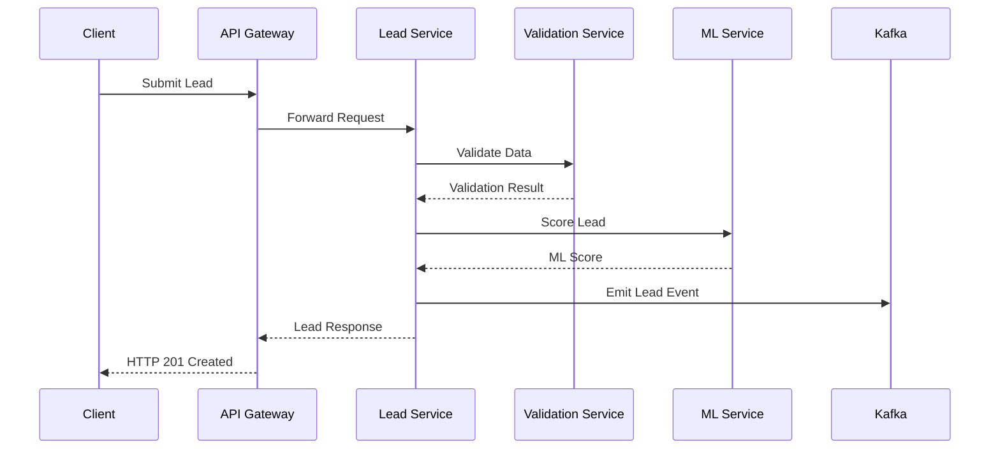

# Lead Service

High-performance microservice for processing, validating, scoring and distributing insurance leads across multiple verticals.

## Overview

The Lead Service is a core component of the Multi-Vertical Insurance Lead Generation Platform, responsible for:

- Processing lead submissions across Auto, Home, Health, Life, Renters and Commercial verticals
- Real-time data validation and enrichment
- ML-based lead scoring
- Event-driven lead distribution
- Horizontal scaling with queue-based processing

### Key Features

- Sub-500ms average response time
- 99.9% uptime SLA
- Event-driven architecture using Kafka
- Circuit breaker pattern for external service calls
- Comprehensive observability with OpenTelemetry
- Field-level encryption for PII data
- Redis caching for validation and scoring results

## Architecture



## Prerequisites

- Node.js >= 20.0.0
- MongoDB >= 6.0
- Redis >= 7.0
- Kafka >= 3.0
- Docker >= 24.0
- Kubernetes >= 1.27

## Installation

### Local Development

```bash
# Install dependencies
npm install

# Set up environment variables
cp .env.example .env

# Start development server
npm run dev
```

### Production Deployment

```bash
# Build Docker image
npm run docker:build

# Deploy to Kubernetes
kubectl apply -f k8s/
```

## Configuration

### Environment Variables

| Variable | Description | Default |
|----------|-------------|---------|
| NODE_ENV | Environment (development/production) | development |
| PORT | Service port | 3000 |
| MONGODB_URI | MongoDB connection string | mongodb://localhost:27017/leads |
| REDIS_URL | Redis connection string | redis://localhost:6379 |
| KAFKA_BROKERS | Kafka broker list | localhost:9092 |
| ENCRYPTION_KEY | Field encryption key | - |
| VALIDATION_SERVICE_URL | Validation service endpoint | http://validation-service |
| ML_SERVICE_URL | ML scoring service endpoint | http://ml-service |

## API Documentation

### Create Lead

```http
POST /api/v1/leads
Content-Type: application/json

{
  "vertical": "AUTO",
  "contact_info": {
    "firstName": "John",
    "lastName": "Doe",
    "email": "john@example.com",
    "phone": "1234567890",
    "address": {
      "street": "123 Main St",
      "city": "Anytown",
      "state": "CA",
      "zip": "12345"
    },
    "dateOfBirth": "1980-01-01"
  },
  "vertical_data": {
    "vehicleYear": 2020,
    "make": "Toyota",
    "model": "Camry"
  },
  "traffic_source": "organic"
}
```

## Security

- JWT-based authentication
- Field-level encryption for PII
- Rate limiting per client
- Input validation and sanitization
- CORS configuration
- Security headers with Helmet
- Regular dependency audits

## Development

### Code Style

- TypeScript strict mode
- ESLint configuration
- Prettier formatting
- Conventional commits

### Testing

```bash
# Unit tests
npm test

# Integration tests
npm run test:integration

# Performance tests
npm run test:performance
```

## Deployment

### Kubernetes Resources

```yaml
# k8s/deployment.yaml
apiVersion: apps/v1
kind: Deployment
metadata:
  name: lead-service
spec:
  replicas: 3
  selector:
    matchLabels:
      app: lead-service
  template:
    spec:
      containers:
      - name: lead-service
        image: lead-service:latest
        resources:
          requests:
            memory: "512Mi"
            cpu: "500m"
          limits:
            memory: "1Gi"
            cpu: "1000m"
```

## Monitoring

### Metrics

- Request latency histogram
- Lead processing counter by vertical
- Validation/scoring error rates
- Circuit breaker status
- Cache hit ratios

### Logging

- Structured JSON logging
- Log correlation with trace IDs
- Log levels: ERROR, WARN, INFO, DEBUG
- Sensitive data masking

### Tracing

- OpenTelemetry integration
- Distributed tracing
- Span attributes for lead processing
- Service dependencies visualization

## Performance

### Optimizations

- Redis caching layer
- Database indexing strategy
- Connection pooling
- Batch processing
- Compression

### Benchmarks

- 99th percentile latency < 500ms
- Throughput: 1000 leads/second
- Cache hit ratio > 80%
- Error rate < 0.1%

## Troubleshooting

### Common Issues

1. Connection timeouts
   - Check network connectivity
   - Verify service endpoints
   - Review circuit breaker status

2. High latency
   - Monitor cache hit ratio
   - Check database indexes
   - Review resource utilization

3. Validation errors
   - Verify input data format
   - Check validation service health
   - Review error logs

## Disaster Recovery

### Backup Procedures

- MongoDB daily snapshots
- Redis persistence
- Configuration backups
- Encrypted secrets backup

### Failover Process

1. Monitor health endpoints
2. Detect region failure
3. Switch to backup region
4. Verify data consistency
5. Update DNS records

### Recovery Time Objectives

- RTO: 5 minutes
- RPO: 0 minutes (real-time replication)