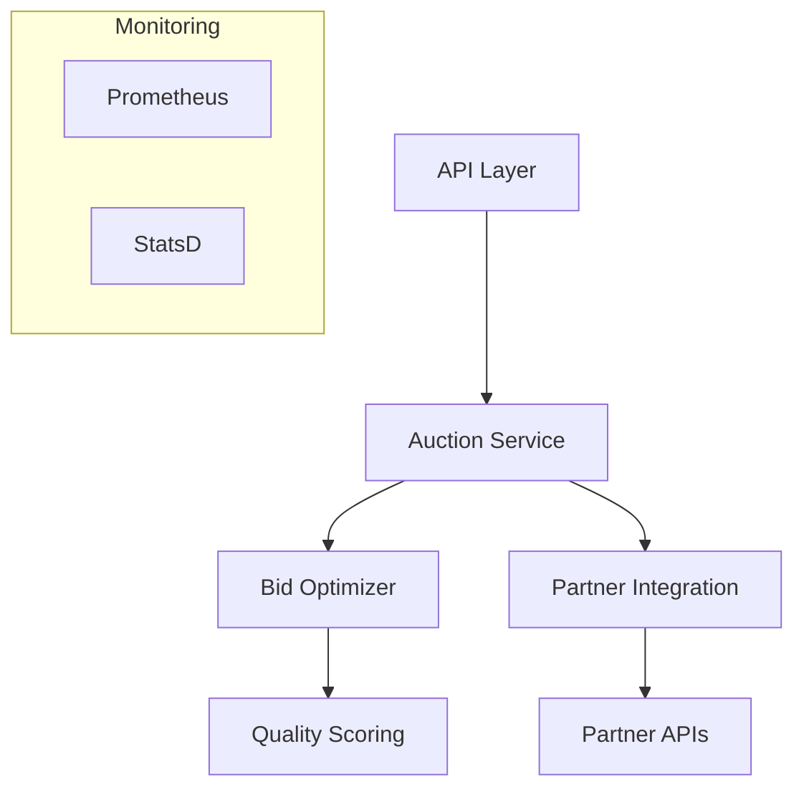
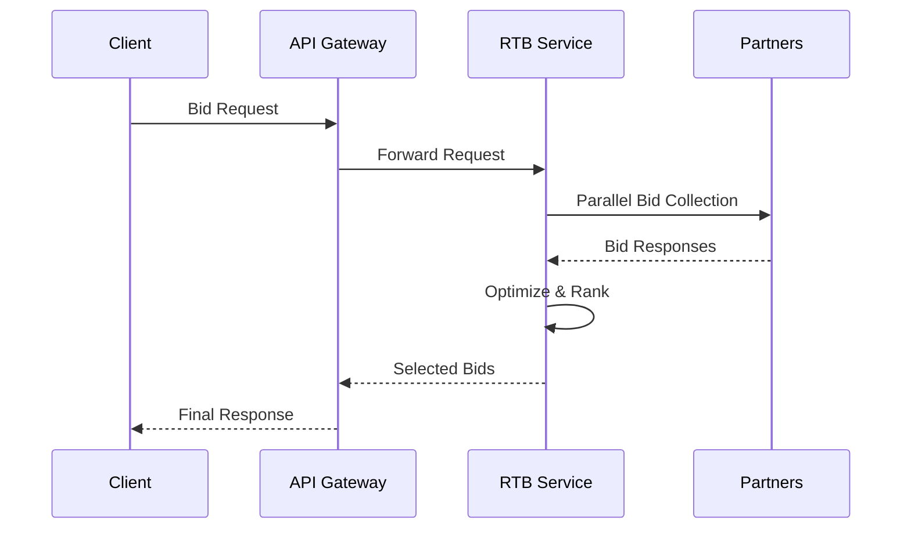

# Real-Time Bidding (RTB) Service

High-performance service for click wall monetization with quality score-based optimization and dynamic pricing.

## Overview

The RTB Service is a critical component of the Multi-Vertical Insurance Lead Generation Platform that handles real-time bid processing for click wall monetization. It provides sub-500ms response times while optimizing bid selection based on quality scores and partner-specific multipliers.

### Key Features
- Real-time bid collection and optimization
- Quality score-based pricing adjustments
- Partner-specific vertical multipliers
- Dynamic time-of-day pricing
- High-performance concurrent processing
- Comprehensive metrics and monitoring

## Architecture

### Core Components


### Data Flow


## Installation

### Prerequisites
- Go 1.21+
- Docker 24+
- Redis 7.0+
- Prometheus/StatsD for metrics

### Build Instructions
```bash
# Install dependencies
go mod download

# Run tests
go test ./... -race

# Build binary
go build -o rtb-service ./src

# Build Docker image
docker build -t rtb-service:latest .
```

## Configuration

### Environment Variables
```
RTB_PORT=8080                    # Service port
RTB_BID_TIMEOUT=500ms           # Maximum bid collection time
RTB_MAX_BIDS_PER_REQUEST=5      # Maximum bids to return
RTB_MIN_BID_PRICE=0.01          # Minimum acceptable bid
RTB_MAX_BID_PRICE=100.0         # Maximum acceptable bid
RTB_ENABLE_DYNAMIC_PRICING=true # Enable price optimization
```

### Partner Configuration
```yaml
partners:
  partner1:
    endpoint: "https://api.partner1.com/bid"
    apiKey: "key1"
    timeout: 200ms
    minBid: 0.05
    maxBid: 50.0
    verticalMultipliers:
      auto: 1.2
      home: 1.1
      health: 1.3
    priority: 1
    enabled: true
```

## API Reference

### Bid Request
```http
POST /v1/bids
Content-Type: application/json

{
  "request_id": "uuid",
  "lead_id": "uuid",
  "vertical": "auto",
  "user_data": {
    "zip": "12345",
    "age": 30
  },
  "timeout": 500
}
```

### Bid Response
```json
{
  "request_id": "uuid",
  "bids": [
    {
      "id": "bid1",
      "partner_id": "partner1",
      "price": 1.50,
      "click_url": "https://...",
      "quality_score": 0.85
    }
  ],
  "processing_time": 150,
  "timestamp": "2024-01-20T10:30:00Z"
}
```

## Metrics

### Core Metrics
- `rtb_requests_total` - Total bid requests received
- `rtb_response_time_ms` - Bid processing latency
- `rtb_partner_timeouts` - Partner timeout count
- `rtb_bid_price_distribution` - Bid price histogram
- `rtb_quality_score_avg` - Average quality scores

### Prometheus Configuration
```yaml
scrape_configs:
  - job_name: 'rtb-service'
    metrics_path: '/metrics'
    static_configs:
      - targets: ['rtb-service:8080']
```

## Partner Integration

### Adding New Partners
1. Add partner configuration to config.yaml
2. Implement partner-specific bid collection
3. Configure quality score adjustments
4. Set up monitoring alerts
5. Test bid flow end-to-end

### Partner Requirements
- Support 200ms response time SLA
- Implement retry with exponential backoff
- Provide bid price and click URL
- Support quality score feedback

## Operations

### Health Checks
```http
GET /health
GET /ready
```

### Monitoring Alerts
- Response time > 500ms
- Error rate > 1%
- Partner timeout rate > 5%
- Invalid bid rate > 2%

### Scaling Guidelines
- Scale horizontally based on RPS
- Monitor Redis connection pool
- Adjust partner timeouts under load
- Cache partner responses

## Security

### Authentication
- mTLS for service communication
- API keys for partner integration
- Rate limiting per partner

### Data Protection
- TLS 1.3 for all traffic
- Bid data encryption at rest
- Partner API key rotation
- Access logging and auditing

## Troubleshooting

### Common Issues
1. Partner timeout
   - Check partner endpoint health
   - Verify network connectivity
   - Review timeout configuration

2. Low bid volume
   - Verify partner bid prices
   - Check quality score calculation
   - Review partner filters

3. High latency
   - Monitor Redis performance
   - Check partner response times
   - Review concurrent processing

### Logging
```go
log.WithFields(log.Fields{
    "request_id": reqID,
    "partner_id": partnerID,
    "latency_ms": latency,
}).Info("Bid processed")
```

## Performance Optimization

### Tuning Guidelines
- Adjust worker pool size
- Optimize Redis connection pool
- Configure partner timeout budgets
- Fine-tune quality score weights
- Implement response caching

### Benchmarks
- 10,000 RPS sustained load
- 99th percentile latency < 500ms
- Partner timeout rate < 1%
- Cache hit ratio > 80%